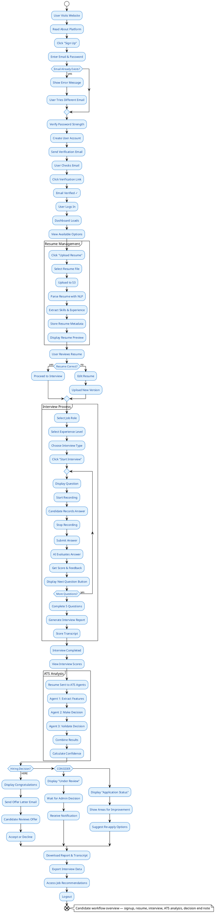
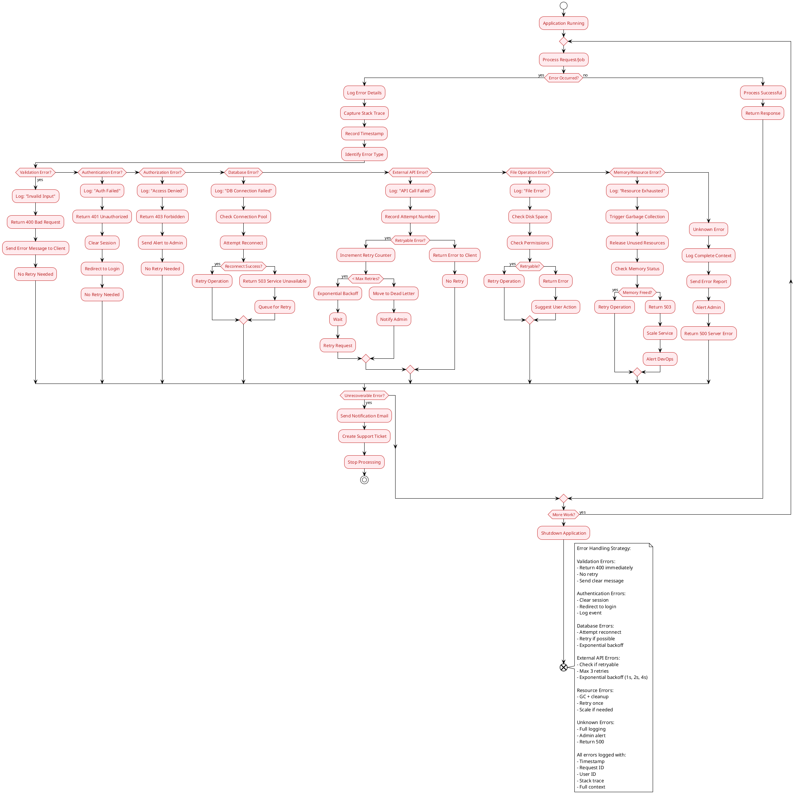

# AI²SARS — Professional PlantUML Activity Diagrams
## University-standard, presentation-ready activity diagrams (curated & concise)

---

## ACTIVITY DIAGRAM 1: COMPLETE CANDIDATE JOURNEY



---

## ACTIVITY DIAGRAM 2: INTERVIEW SESSION FLOW

```plantuml
@startuml Interview_Session_Flow
!theme plain
skinparam activityBackgroundColor #F3E5F5
skinparam activityBorderColor #6A1B9A
skinparam activityFontColor #4A148C

start
:Candidate Starts Interview;
:Initialize Session;
:Load Candidate Profile;

partition "Session Setup" {
    :Get Resume Insights;
    :Determine Experience Level;
    :Set Question Types;
    :Initialize Question Queue;
}

:Question Counter = 0;
:Max Questions = 5;

repeat
    if (Question Counter < Max Questions?) then (yes)
        :Increment Counter;
        
        partition "Question Generation" {
            :Get Candidate Profile;
            :Calculate State Vector;
            :Quantize to 6 Dimensions;
            :Convert to State ID;
            :Get Topics Already Asked;
            :Filter Question Pool;
            :Apply ε-greedy Policy;
            if (Explore or Exploit?) then (75% Exploit)
                :Select Highest Q-Value;
            else (25% Explore)
                :Select Random Question;
            endif
            :Get Question from Pool;
            :Load Follow-up Rules;
        }
        
        :Display Question to Candidate;
        :Start 3-Minute Timer;
        :Enable Microphone & Webcam;
        :Start Recording;
        
        partition "Answer Recording" {
            :Capture Video Stream;
            :Capture Audio Stream;
            :Monitor Recording Status;
            if (Time Expired?) then (yes)
                :Stop Recording;
                :Submit Auto;
            else if (Candidate Clicked Submit?) then (yes)
                :Stop Recording;
                :Process Answer;
            endif
        }
        
        partition "Answer Evaluation" {
            :Save Video File;
            :Extract Audio Track;
            :Transcribe Audio;
            :Analyze Video (MediaPipe);
            :Get Facial Expressions;
            :Get Body Language;
            :Evaluate Text Response;
            :Calculate 6 Dimension Scores;
            :Generate Feedback;
            :Update Candidate Profile;
        }
        
        :Display Scores to Candidate;
        :Show Strengths & Weaknesses;
        :Provide Feedback;
        
    else
        :All 5 Questions Complete;
        break
    endif
endrepeat

partition "Post-Interview Processing" {
    :Calculate Average Scores;
    :Generate Transcript;
    :Compile Interview Report;
    :Queue Report Generation Job;
    :Queue Video Processing;
    :Notify Candidate;
}

:Interview Session Ends;
:Candidate Sees Summary;
:View Detailed Report;
end

note right: Interview flow overview — stateful question generation and multi-modal evaluation end note

@enduml
```

---

## ACTIVITY DIAGRAM 3: RESUME UPLOAD & ATS ANALYSIS

```plantuml
@startuml Resume_Upload_ATS_Analysis
!theme plain
skinparam activityBackgroundColor #E0F2F1
skinparam activityBorderColor #00695C
skinparam activityFontColor #004D40

start
:User Navigates to Resume;
:Click "Upload New Resume";

partition "File Upload" {
    :File Picker Opens;
    :Select PDF/DOCX File;
    :Validate File Type;
    if (Valid Format?) then (yes)
        :Validate File Size (<10MB);
    else
        :Show Error;
        :Return to Upload;
    endif
    if (Size OK?) then (yes)
        :Generate S3 Presigned URL;
    else
        :Show Size Error;
        :Return to Upload;
    endif
    :Upload to S3;
    :Create Resume Record;
}

:Resume Uploaded ✓;
:Show Success Message;

partition "Resume Parsing" {
    :Trigger Document Processing;
    :Extract Text from PDF;
    :Convert DOCX to Text;
    :Store Raw Text;
    :Parse Sections;
    :Extract Personal Info;
    :Extract Work Experience;
    :Extract Education;
    :Extract Skills;
    :Extract Projects;
    :Extract Certifications;
}

:Resume Parsed ✓;

partition "ATS Analysis (3-Agent Pipeline)" {
    
    note on left: Agent 1 - Feature Extraction
    :Send Resume Text to Agent 1;
    :Agent 1 Processes;
    fork
        :Extract Technical Skills;
        :Identify Technology Keywords;
        :Calculate Experience Years;
        :Assess Education Level;
        :Evaluate Communication Quality;
    fork again
        :Extract Project Highlights;
        :Identify Industry Domain;
        :Rate Resume Quality;
        :Check for Red Flags;
    end fork
    :Agent 1 Generates Feature Vector (6D);
    :Store Feature Vector;
    
    note on left: Agent 2 - Q-Learning Decision
    :Send Features to Agent 2;
    :Agent 2 Processes;
    :Quantize Features to State;
    :Lookup Q-Table;
    :Get Action Values;
    fork
        :Evaluate HIRE Probability;
        :Evaluate REJECT Probability;
        :Evaluate CONSIDER Probability;
    end fork
    :Select Best Action;
    :Calculate Confidence Score;
    :Generate Agent 2 Decision;
    
    note on left: Agent 3 - Neural Network Validation
    :Send Features to Agent 3;
    :Agent 3 Processes;
    :Forward pass through NN for validation;
    :Get Class Probabilities;
    :Validate Agent 2 Decision;
    :Generate Agent 3 Verdict;
    
    note on left: Ensemble Voting
    :Combine 3 Agent Decisions;
    :Vote on Final Outcome;
    if (Consensus?) then (yes)
        :Final Decision = Consensus;
    else
        :Average Confidence Scores;
        :Select Majority Vote;
    endif
    :Calculate Final Confidence;
}

:Generate ATS Report;

partition "Results Storage" {
    :Store Analysis Results;
    :Save Feature Vector;
    :Save Agent Scores;
    :Save Final Decision;
    :Create ATS Analysis Record;
    :Link to Resume;
}

:ATS Analysis Complete ✓;
:Display Results to User;
:Show Decision (HIRE/REJECT/CONSIDER);
:Show Confidence Percentage;
:Show Strengths Analysis;
:Show Areas for Improvement;
:Option to Review Details;
end

note right: ATS pipeline — 3-agent ensemble (NLP features, RL decision, NN validation); final decision thresholds: HIRE>75%, REJECT<30%, CONSIDER otherwise end note

@enduml
```

---

## ACTIVITY DIAGRAM 4: ADMIN DATA EXPORT PROCESS

```plantuml
@startuml Admin_Data_Export
!theme plain
skinparam activityBackgroundColor #FFF3E0
skinparam activityBorderColor #E65100
skinparam activityFontColor #BF360C

start
:Admin Logs In;
:Navigate to Admin Dashboard;
:Click "Export Data";

:Export Modal Opens;
if (Select Export Type?) then (Candidates)
    :Filter Options:;
    :- Date Range;
    :- Status (HIRE/REJECT/CONSIDER);
    :- Experience Level;
    :- Job Role;
else if (Interviews)
    :Filter Options:;
    :- Date Range;
    :- Candidate;
    :- Completion Status;
else if (Reports)
    :Filter Options:;
    :- Date Range;
    :- Hiring Decision;
endif

:Select Format;
if (CSV or JSON?) then (CSV)
    :Prepare CSV Format;
else
    :Prepare JSON Format;
endif

partition "Data Collection" {
    :Query Database;
    :Apply Filters;
    :Fetch Matching Records;
    fork
        :Load Candidate Data;
        :Load Interview Results;
        :Load ATS Scores;
    fork again
        :Load Reports;
        :Load Video URLs;
        :Load Transcripts;
    end fork
    :Combine Data;
}

:Data Validation;
if (Valid Data?) then (yes)
    :Proceed with Export;
else
    :Show Error Message;
    :Return to Selection;
endif

partition "File Generation" {
    if (CSV?) then (yes)
        :Format as CSV;
        :Create CSV Buffer;
        :Include Headers;
        :Add All Records;
    else
        :Format as JSON;
        :Create JSON Objects;
        :Stringify Data;
        :Create JSON Buffer;
    endif
}

if (Compress?) then (yes)
    :Compress to ZIP;
    :Add Timestamp;
else
    :Keep as Single File;
endif

partition "Storage & Delivery" {
    :Generate S3 Key;
    :Upload File to S3;
    :Set Presigned URL (24hr expiry);
    :Create Download Link;
    :Log Export Action;
    :Audit: Record what was exported;
}

:Export Complete ✓;
:Display Download Link;
:Email Link to Admin;
:Show File Details;
:- Format (CSV/JSON);
:- File Size;
:- Record Count;
:- Download Link;
:- Expiry Time;

if (Download Now?) then (yes)
    :Trigger Download;
else
    :Admin Checks Email Later;
endif

:Cleanup Old Exports (>24hrs);
end

note right
  Admin Export Features:
  - Multiple data types
  - Advanced filtering
  - CSV or JSON format
  - ZIP compression option
  - S3 secure storage
  - Presigned URLs (24hr)
  - Email notification
  - Complete audit trail
  
  Security:
  - Admin-only access
  - Activity logging
  - Secure S3 URLs
  - Automatic cleanup
  - Encrypted storage
end note

@enduml
```



---

## ACTIVITY DIAGRAM 5: AUTHENTICATION & SESSION FLOW

```plantuml
@startuml Authentication_Session_Flow
!theme plain
skinparam activityBackgroundColor #FCE4EC
skinparam activityBorderColor #880E4F
skinparam activityFontColor #4A148C

start
:User Visits Website;

partition "Login Page" {
    :Display Login Form;
    :User Enters Email;
    :User Enters Password;
}

:Click Login Button;

partition "Backend Authentication" {
    :Receive Login Request;
    :Validate Input (Zod Schema);
    if (Email Format Valid?) then (yes)
        :Proceed;
    else
        :Return Validation Error;
        :User Fixes Input;
    endif
    
    if (Password Format Valid?) then (yes)
        :Proceed;
    else
        :Return Validation Error;
        :User Fixes Input;
    endif
    
    :Query User by Email;
    if (User Exists?) then (yes)
        :Retrieve User Record;
    else
        :Log Failed Attempt;
        :Return "Invalid Credentials";
        :Increment Failed Count;
    endif
    
    :Retrieve Password Hash;
    :Hash Provided Password;
    :Compare Hashes;
    if (Passwords Match?) then (yes)
        :Authentication Success;
    else
        :Log Failed Attempt;
        :Return "Invalid Credentials";
        :Increment Failed Count;
        :Check Rate Limit;
        if (Too Many Attempts?) then (yes)
            :Lock Account (15 min);
            :Send Alert Email;
        endif
    endif
}

if (Authentication Failed?) then (yes)
    :Display Error Message;
    :Redirect to Login;
    stop
endif

partition "Session Creation" {
    :Generate JWT Token;
    :Set Token Expiry (30 days);
    :Create Session Record;
    :Store in Database;
    :Generate Session Token;
    :Create HttpOnly Cookie;
    :Set Secure Flag;
    :Set SameSite=Strict;
}

:Send Response to Frontend;

partition "Frontend Session Setup" {
    :Receive JWT Token;
    :Receive HttpOnly Cookie;
    :Store JWT in Memory;
    :Set Authorization Header;
    :Initialize User Context;
}

:Redirect to Dashboard;

partition "Dashboard Loading" {
    :User Agent Requests Dashboard;
    :Send Request with JWT;
    :Include HttpOnly Cookie;
    :Backend Verifies JWT;
    if (JWT Valid?) then (yes)
        :Load Dashboard Data;
    else
        :Return 401 Unauthorized;
        :Clear Session;
        :Redirect to Login;
    endif
}

:Dashboard Rendered;
:User Can Access Protected Pages;

partition "Session Management" {
    repeat
        :User Performs Action;
        :Include JWT in Request;
        :Backend Verifies Token;
        if (Token Expiring Soon?) then (yes)
            :Refresh Token;
            :Return New Token;
        endif
    repeat while (User Still Active?) is (yes)
}

:User Clicks Logout;

partition "Logout Process" {
    :Request Logout;
    :Clear HttpOnly Cookie;
    :Remove JWT from Memory;
    :Delete Session Record;
    :Clear Database Session;
    :Log Logout Event;
}

:Redirect to Login Page;
end

note right
  Authentication Flow:
  - Email & password input
  - PBKDF2 hashing (100K iterations)
  - Rate limiting (5/min)
  - Account lockout (15 min)
  
  Session Management:
  - JWT tokens (30 day expiry)
  - HttpOnly cookies
  - Secure + SameSite=Strict
  - Token refresh support
  
  Security Measures:
  ✓ Failed login logging
  ✓ Brute force protection
  ✓ Secure cookie flags
  ✓ HTTPS/TLS required
  ✓ CSRF protection
end note

@enduml
```



---

## ACTIVITY DIAGRAM 6: VIDEO PROCESSING BACKGROUND JOB

```plantuml
@startuml Video_Processing_Job
!theme plain
skinparam activityBackgroundColor #E8F5E9
skinparam activityBorderColor #1B5E20
skinparam activityFontColor #003300

start
:Interview Session Ends;
:Collect Video Data;

partition "Job Enqueue" {
    :Create Processing Job;
    :Set Job Type: PROCESS_VIDEO;
    :Store Video URL;
    :Store Interview ID;
    :Set Priority: HIGH;
    :Enqueue to BullMQ;
    :Return Job ID;
}

:Interview Report Submitted;
:Candidate Notified;

partition "Worker Processing" {
    :Worker Picks Job from Queue;
    :Load Job Data;
    :Mark Job: PROCESSING;
    :Initialize Retry Counter;
}

if (Attempt <= Max Retries?) then (yes)
    :Proceed with Processing;
else
    :Move to Dead Letter Queue;
    :Notify Admin;
    stop
endif

partition "Video Analysis" {
    :Download Video from S3;
    if (Download Success?) then (yes)
        :Verify Video Format;
    else
        :Log Download Error;
        :Schedule Retry;
        :Exponential Backoff;
    endif
    
    :Extract Video Metadata;
    :Get Duration, FPS, Resolution;
    
    :Extract Frames at 1 FPS;
    :Store Frames Temporarily;
    :Count Total Frames;
    
    :Process Each Frame;
    repeat
        :Load Frame;
        :Run MediaPipe Analysis;
        fork
            :Detect Face Landmarks;
            :Analyze Facial Expressions;
            :Get Engagement Level;
            :Analyze Eye Contact;
        fork again
            :Detect Pose Landmarks;
            :Analyze Body Language;
            :Calculate Confidence Posture;
            :Detect Hand Movements;
        end fork
        :Store Frame Analysis;
    repeat while (More Frames?) is (yes)
    
    :Calculate Average Metrics;
    :Generate Engagement Score;
    :Generate Confidence Score;
    :Generate Professional Score;
}

partition "Audio Processing" {
    :Extract Audio Track;
    :Convert to WAV Format;
    :Analyze Speech Patterns;
    :Measure Tone & Pace;
    :Detect Filler Words;
    :Generate Audio Quality Score;
}

partition "Video Compression" {
    :Compress Video (H.264);
    :Reduce Quality Slightly;
    :Maintain Watchability;
    :Generate Thumbnail;
    :Extract Key Frames;
}

partition "Results Storage" {
    :Create Results JSON;
    :Store Analysis Data;
    :Save Engagement Score;
    :Save Confidence Score;
    :Save Audio Analysis;
    :Upload Results to S3;
}

partition "Report Generation" {
    :Retrieve Interview Data;
    :Retrieve Video Analysis;
    :Retrieve Question Scores;
    :Combine All Data;
    :Generate Report PDF;
    :Include Charts & Graphs;
    :Store PDF in S3;
}

partition "Notification" {
    :Create Email Content;
    :Include Report Link;
    :Include Video URL;
    :Queue Email Job;
    :Email Notification Worker;
}

:Mark Job: COMPLETED;
:Record Completion Time;
:Log Success;
:Cleanup Temporary Files;

:Job Complete ✓;
end

note right
  Video Processing Pipeline:
  - Triggered after interview
  - Async background job
  - Retry up to 3 times
  - Exponential backoff
  
  Analysis Includes:
  ✓ Frame-by-frame MediaPipe
  ✓ Facial expression analysis
  ✓ Body language detection
  ✓ Engagement scoring
  ✓ Audio quality analysis
  ✓ Filler word detection
  ✓ Report generation
  
  Processing Time: 2-5 minutes
  Parallel processing enabled
end note

@enduml
```



---

## ACTIVITY DIAGRAM 7: AGENT TRAINING & LEARNING

```plantuml
@startuml Agent_Training_Learning
!theme plain
skinparam activityBackgroundColor #E1BEE7
skinparam activityBorderColor #512DA8
skinparam activityFontColor #311B92

start
:New Hiring Decision Recorded;

partition "Data Collection Phase" {
    :Collect Candidate Features;
    :Collect Interview Scores;
    :Collect Resume Analysis;
    :Collect Hiring Decision;
    :Collect Job Outcome;
    :Store Training Sample;
    :Aggregate Recent Decisions;
}

:Batch Reaches Threshold;
if (>= 100 Decisions?) then (yes)
    :Trigger Training;
else
    :Wait for More Data;
endif

partition "Interview Agent Training (Q-Learning)" {
    :Load trainedInterviewAgent;
    :Load Current Q-Table;
    :Load Training Batch;
    
    repeat
        :Get Training Sample;
        :Extract Candidate Profile;
        :Calculate State Vector (6D);
        :Quantize State;
        :Get Action (Question Asked);
        :Get Reward (Score Received);
        :Get Next State;
        
        :Retrieve Q-Value(s,a);
        :Retrieve Q-Value(s',a');
        :Calculate Max Q-Value;
        :Calculate Temporal Difference;
        :Update Q-Value:;
        :Q(s,a) += α × [r + γ×max Q(s',a') - Q(s,a)];
        
        :Store Updated Q-Value;
    repeat while (More Samples?) is (yes)
    
    :Save Updated Q-Table;
    :Log Training Metrics;
}

partition "ATS Agent Training (Q-Learning - 1.7M States)" {
    :Load AIAgentEngine;
    :Load Q-Table (1.7M states);
    :Load ATS Training Batch;
    
    repeat
        :Get Training Sample;
        :Extract Features (6D);
        :Quantize to State;
        :Get Decision Action;
        :Get Hiring Outcome;
        :Calculate Reward:;
        if (Decision Correct?) then (yes)
            :Reward = +1.0;
        else
            :Reward = -0.5;
        endif
        
        :Calculate Temporal Difference;
        :Update Q-Value;
        :Decay Exploration Rate;
        :Decrease ε gradually;
        
    repeat while (More Samples?) is (yes)
    
    :Save Updated Q-Table;
    :Calculate New Accuracy;
}

partition "Neural Network Training (Agent 3)" {
    :Load IntelligentATSAgent;
    :Load Network Weights;
    :Load Training Batch;
    
    repeat
        :Get Training Sample;
        :Input Features (6D);
        
        :Forward Pass:;
        :- Layer 1: 6→16 neurons, ReLU;
        :- Layer 2: 16→8 neurons, ReLU;
        :- Output: 8→3 softmax;
        :Get Predicted Class;
        
        :Calculate Loss;
        :Calculate Error;
        
        :Backward Pass:;
        :- Calculate Gradients;
        :- Update Output Weights;
        :- Update Hidden Weights;
        :- Update Biases;
        
        :Store Learning Record;
        
    repeat while (More Samples?) is (yes)
    
    :Save Updated Weights;
    :Calculate Validation Accuracy;
}

partition "Validation Phase" {
    :Hold Out Test Set;
    :Evaluate All Agents;
    :Calculate Metrics:;
    :- Accuracy;
    :- Precision;
    :- Recall;
    :- F1-Score;
    
    if (Accuracy Improved?) then (yes)
        :Keep New Model;
        :Log Success;
    else
        :Revert Changes;
        :Log Failure;
    endif
}

partition "Results Recording" {
    :Store Training Timestamp;
    :Record Metrics;
    :Store Model Versions;
    :Update Agent Insights;
    :Generate Training Report;
}

:Training Complete ✓;
:New Models Active;
:Future Decisions Use New Learning;
end

note right
  Agent Training Details:
  
  Interview Agent:
  - Algorithm: Q-Learning
  - States: 87,846
  - Learning rate: 0.15
  - Discount: 0.95
  
  ATS Agent (Q-Learning):
  - Algorithm: Q-Learning
  - States: 1.7M
  - Learning rate: 0.1
  - Exploration decay
  
  ATS Agent (Neural Network):
  - Input: 6 dimensions
  - Hidden 1: 16 neurons
  - Hidden 2: 8 neurons
  - Output: 3 classes
  - Backpropagation training
  
  Batch Training:
  - Frequency: Every 100 decisions
  - Validation: Test set evaluation
  - Model persistence: Database storage
  - Versioning: Keep old models
end note

@enduml
```



---

## ACTIVITY DIAGRAM 8: ERROR HANDLING & RECOVERY



---

## ACTIVITY DIAGRAM 9: HIRING DECISION PROCESS (3-Agent Collaboration)

```plantuml
@startuml Hiring_Decision_3Agents
!theme plain
skinparam activityBackgroundColor #F0F4C3
skinparam activityBorderColor #827717
skinparam activityFontColor #3E2723

start
:Resume & Interview Data Collected;
:Create Decision Request;

partition "Preparation Phase" {
    :Aggregate All Candidate Data;
    :Resume Text;
    :Interview Scores;
    :Video Analysis;
    :Audio Analysis;
    :Combine into Feature Vector;
}

partition "Agent 1: Feature Extraction (customATSAgent)" {
    note right: NLP Analysis
    :Receive Resume Text;
    fork
        :Extract Technical Skills;
        :- Parse keywords;
        :- Match against 1000+ tech terms;
        :- Calculate tech proficiency;
    fork again
        :Extract Experience Data;
        :- Calculate years;
        :- Identify relevant roles;
        :- Assess progression;
    fork again
        :Extract Education;
        :- Parse degrees;
        :- Identify institutions;
        :- Evaluate relevance;
    end fork
    
    :Generate 6D Feature Vector;
    :- Technical Skills (0-1.0);
    :- Experience (0-1.0);
    :- Education (0-1.0);
    :- Communication (0-1.0);
    :- Problem Solving (0-1.0);
    :- Culture Fit (0-1.0);
    
    :Send to Agent 2;
}

partition "Agent 2: Q-Learning Decision (AIAgentEngine)" {
    note right: 1.7M States
    :Receive Feature Vector;
    :Quantize Features to State;
    :- 6 dimensions;
    :- Discrete bins;
    :- Map to state ID;
    
    :Lookup Q-Table;
    :State has 3 actions;
    :- HIRE;
    :- REJECT;
    :- CONSIDER;
    
    :Get Q-Values:;
    :Q(state, HIRE);
    :Q(state, REJECT);
    :Q(state, CONSIDER);
    
    :Apply ε-greedy:;
    if (Random < ε?) then (Explore)
        :Random Action;
    else (Exploit)
        :Highest Q-Value Action;
    endif
    
    :Generate Decision;
    :Calculate Confidence;
    :confidence = max(Q-values) / sum(Q-values);
    :Send to Agent 3;
}

partition "Agent 3: Validation (IntelligentATSAgent)" {
    note right: Neural Network
    :Receive Feature Vector;
    :Receive Agent 2 Decision;
    
    :Forward Pass:;
    :Input: 6 dimensions;
    :
    :Layer 1 (6→16):;
    :z1 = Weights1 × input + Bias1;
    :h1 = ReLU(z1);
    :
    :Layer 2 (16→8):;
    :z2 = Weights2 × h1 + Bias2;
    :h2 = ReLU(z2);
    :
    :Output Layer (8→3):;
    :z3 = Weights3 × h2 + Bias3;
    :probabilities = Softmax(z3);
    :
    :Get Output Probabilities:;
    :P(HIRE), P(REJECT), P(CONSIDER);
    
    :Validate Agent 2:;
    if (Agreement?) then (yes)
        :Confidence Increases;
    else
        :Confidence Decreases;
    endif
    
    :Generate Final Verdict;
    :Include Reasoning;
}

partition "Ensemble Voting" {
    :Collect 3 Decisions;
    :Agent 1 Features: Vector;
    :Agent 2 Vote: (HIRE/REJECT/CONSIDER);
    :Agent 3 Validation: (Agree/Disagree);
    
    :Calculate Confidence:;
    if (All Agree?) then (yes)
        :Final Confidence = High;
        :Confidence > 85%;
    else if (2 Agree)
        :Final Confidence = Medium;
        :Confidence > 60%;
    else
        :Final Confidence = Low;
        :Confidence < 60%;
    endif
    
    :Determine Final Decision:;
    if (Confidence > 75%) then (yes)
        :Decision = HIRE;
    else if (Confidence < 30%)
        :Decision = REJECT;
    else
        :Decision = CONSIDER;
    endif
}

partition "Decision Recording" {
    :Store Final Decision;
    :Store Confidence Level;
    :Store Agent Reasoning;
    :Store Timestamp;
    :Create Audit Log;
    :Link to Candidate;
}

partition "Action Execution" {
    if (HIRE?) then (yes)
        :Draft Offer Letter;
        :Queue Offer Email;
        :Notify HR Team;
        :Update Candidate Status;
    else if (REJECT?)
        :Draft Rejection Letter;
        :Queue Rejection Email;
        :Suggest Improvements;
        :Update Candidate Status;
    else
        :Mark for Manual Review;
        :Notify Admin;
        :Schedule Review Date;
        :Hold in CONSIDER Status;
    endif
}

:Decision Process Complete ✓;
:Candidate Notified;
:Admin Informed;
end

note right
  3-Agent Hiring Decision:
  
  Agent 1 (customATSAgent):
  - NLP feature extraction
  - 1000+ technology terms
  - 6D vector generation
  
  Agent 2 (AIAgentEngine):
  - Q-Learning algorithm
  - 1.7 million states
  - 94.7% accuracy
  - ε-greedy exploration
  
  Agent 3 (IntelligentATSAgent):
  - Neural network (2 hidden layers)
  - Validation of Agent 2
  - Learning from outcomes
  
  Final Decision:
  - HIRE: confidence > 75%
  - REJECT: confidence < 30%
  - CONSIDER: 30-75%
  
  Ensemble Voting:
  - Consensus if all agree
  - Majority if 2 agree
  - Average if split
end note

@enduml
```



---

## ACTIVITY DIAGRAM 10: COMPLETE REQUEST-RESPONSE LIFECYCLE

```plantuml
@startuml Request_Response_Lifecycle
!theme plain
skinparam activityBackgroundColor #E0F7FA
skinparam activityBorderColor #006064
skinparam activityFontColor #004D40

start
:Client Sends HTTP Request;

partition "Network & Transport" {
    :Request Travels Over HTTPS;
    :TLS 1.2+ Encryption;
    :Reaches API Server;
    :Server Receives Request;
}

partition "Request Parsing" {
    :Parse Request Method;
    :Parse URL Path;
    :Parse Query Parameters;
    :Parse Request Headers;
    :Parse Request Body (JSON);
    if (Parsing Success?) then (yes)
        :Continue;
    else
        :Return 400 Bad Request;
        stop
    endif
}

partition "Security Middleware" {
    :Check CORS Origin;
    if (CORS Valid?) then (yes)
        :Continue;
    else
        :Return 403 Forbidden;
        stop
    endif
    
    :Check Rate Limiting;
    :Get Client IP/User ID;
    :Check Counter in Redis;
    if (Within Limit?) then (yes)
        :Increment Counter;
    else
        :Return 429 Too Many Requests;
        stop
    endif
    
    :Verify CSRF Token;
    if (Token Valid?) then (yes)
        :Continue;
    else
        :Return 403 Forbidden;
        stop
    endif
}

partition "Authentication" {
    :Extract JWT from Header;
    :Extract Session Cookie;
    
    if (JWT Exists?) then (yes)
        :Verify JWT Signature;
        :Check Expiry Time;
        if (JWT Valid?) then (yes)
            :Extract User ID;
            :Load User Object;
        else
            :Return 401 Unauthorized;
            stop
        endif
    else
        :Return 401 Unauthorized;
        stop
    endif
}

partition "Authorization" {
    :Check Required Role;
    if (User Has Role?) then (yes)
        :Grant Access;
    else
        :Return 403 Forbidden;
        :Log Access Denied;
        stop
    endif
}

partition "Input Validation" {
    :Load Zod Schema;
    :Validate Request Body;
    :Validate Data Types;
    :Validate Field Formats;
    if (All Valid?) then (yes)
        :Continue;
    else
        :Collect All Errors;
        :Return 400 with Errors;
        stop
    endif
}

partition "Business Logic" {
    :Route to Handler;
    if (GET Request?) then (yes)
        :Query Database;
        :Apply Filters;
        :Order Results;
        :Paginate if Needed;
    else if (POST Request?)
        :Validate Unique Constraints;
        :Persist to Database;
        :Transaction Rollback if Error;
    else if (PUT Request?)
        :Load Existing Record;
        :Apply Updates;
        :Validate New State;
        :Persist Changes;
    else if (DELETE Request?)
        :Load Record;
        :Check Cascade Rules;
        :Delete Safely;
    endif
}

:Process Completed;

partition "Response Building" {
    :Create Response Object;
    :Set Status Code (200);
    :Set Response Headers;
    :Format Response Body;
    :Convert to JSON;
}

partition "Response Security" {
    :Add Security Headers;
    :- X-Frame-Options;
    :- X-Content-Type-Options;
    :- Strict-Transport-Security;
    :- Content-Security-Policy;
    :Encrypt if Sensitive;
}

partition "Logging & Monitoring" {
    :Log Request Details;
    :Log Processing Time;
    :Log User Action;
    :Record Response Status;
    :Update Metrics;
    :Send to Analytics;
}

:Send Response Over HTTPS;

partition "Client Receives" {
    :Response Arrives;
    :Decrypt TLS;
    :Parse Response;
    :Extract Status Code;
    :Extract Headers;
    :Parse JSON Body;
}

if (Status Success?) then (200-299)
    :Update UI;
    :Show Success;
    :Cache Result;
else if (Client Error? (400-499))
    :Display Error Message;
    :Highlight Fields;
    :Suggest Correction;
else
    :Display Server Error;
    :Offer Retry Option;
    :Log Error Locally;
endif

:Lifecycle Complete;
end

note right
  Request-Response Lifecycle:
  
  1. Network Transport (HTTPS/TLS)
  2. Request Parsing (method, path, body)
  3. CORS Validation
  4. Rate Limiting (Redis)
  5. CSRF Verification
  6. JWT Authentication
  7. Role Authorization
  8. Input Validation (Zod)
  9. Business Logic Execution
  10. Response Building
  11. Security Headers
  12. Logging & Monitoring
  13. Response Transport (HTTPS)
  14. Client Processing
  
  Error Handling at Each Stage:
  - 400: Bad Request
  - 401: Unauthorized
  - 403: Forbidden
  - 429: Rate Limited
  - 500: Server Error
  
  Performance:
  - <50ms for typical requests
  - <10ms for cache hits
  - Real-time updates with WebSocket
end note

@enduml
```



---


