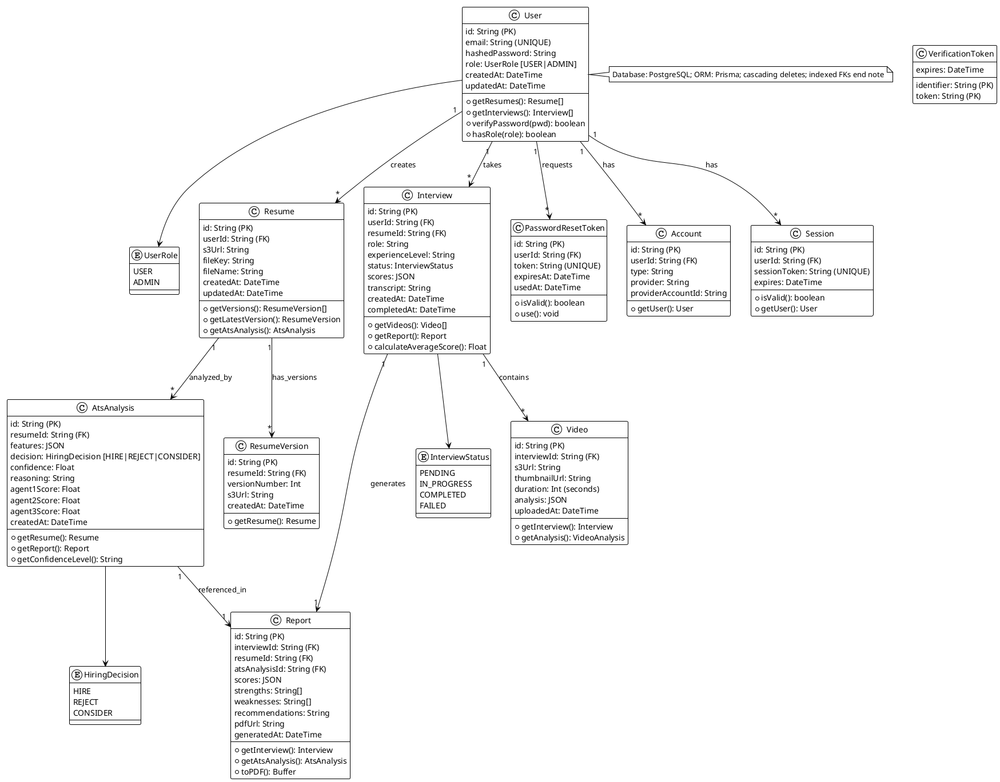
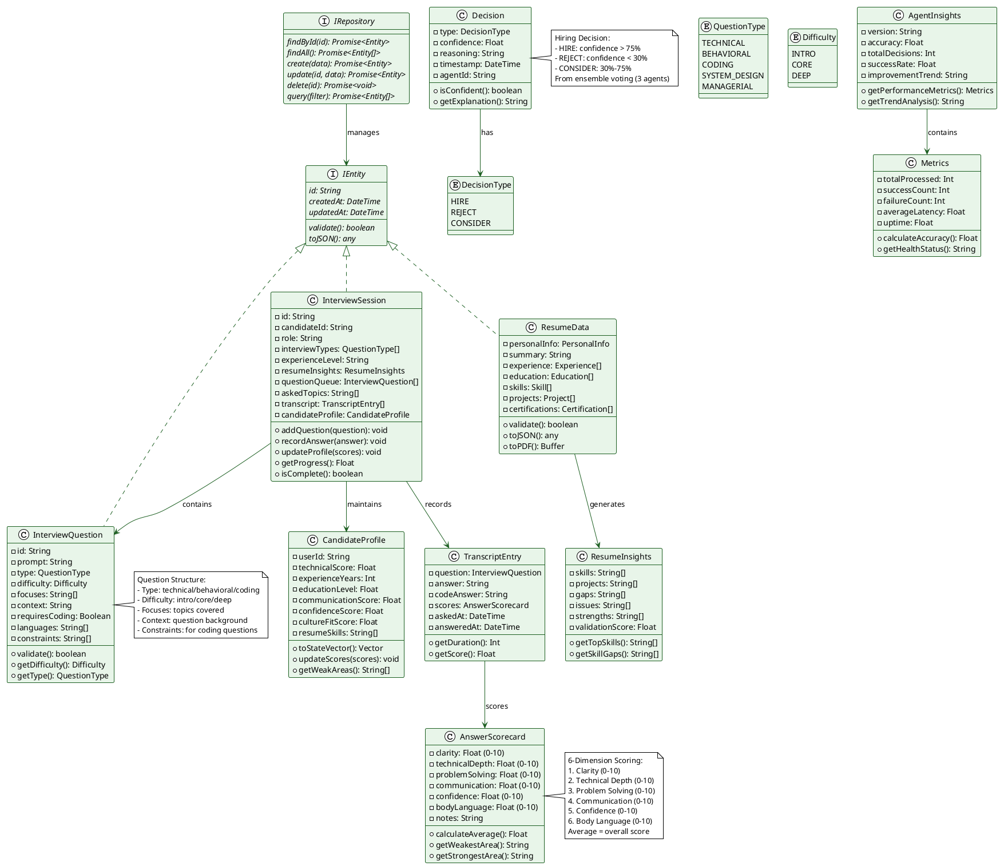
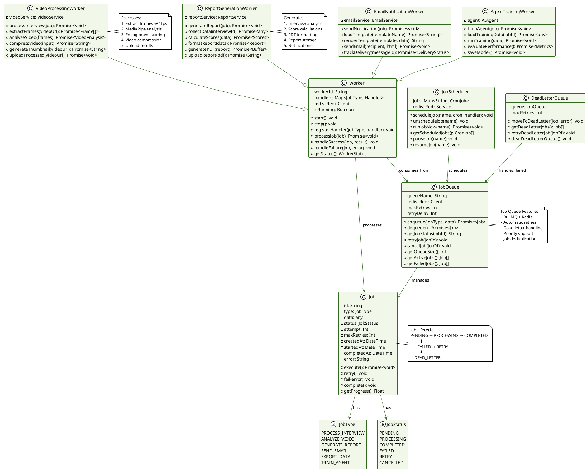
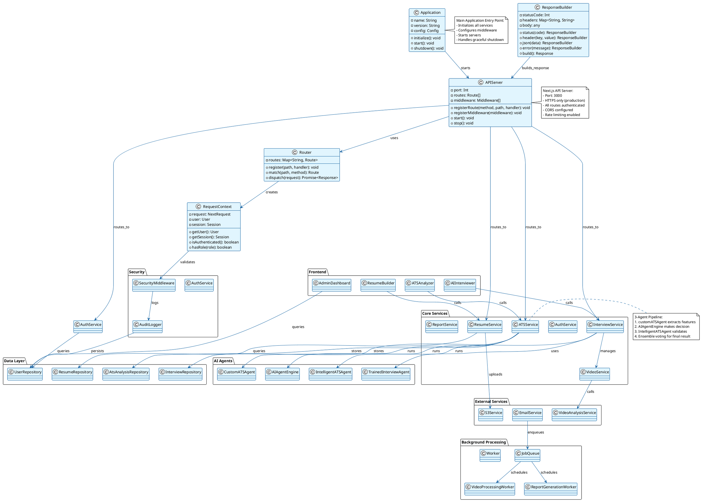

# AI²SARS — Professional PlantUML Class Diagrams
## University-standard, presentation-ready class diagrams (curated & concise)

---

## CLASS DIAGRAM 1: DATABASE MODELS & RELATIONSHIPS

---

## CLASS DIAGRAM 2: AI AGENTS ARCHITECTURE

```plantuml
@startuml AI_Agents_Architecture
!theme plain
skinparam classBackgroundColor #F3E5F5
skinparam classBorderColor #4A148C
skinparam classArrowColor #4A148C

interface AIAgent {
    {abstract} process(): Promise
    {abstract} learn(): void
    {abstract} getMetrics(): Metrics
}

class TrainedInterviewAgent {
    - qTable: Map<String, Map<String, number>>
    - stateSpace: 87846
    - actionSpace: 5
    - learningRate: 0.15
    - discountFactor: 0.95
    - explorationRate: 0.25
    --
    + quantizeState(profile): StateKey
    + recommendNextQuestion(profile, types, askedTopics)
    + getQValue(state, action): number
    + updateQValue(state, action, reward, nextState)
    + buildFollowUp(previousQ, answer): Question
}

class CustomATSAgent {
    - vocabularyTerms: String[]
    - industryWeights: Map<String, Float>
    - roleProfiles: Map<String, RoleProfile>
    - trainingData: TrainingData[]
    --
    + analyzeResume(text): ResumeFeatures
    + extractSkills(text): String[]
    + calculateExperience(text): number
    + assessEducation(text): number
    + evaluateCommunication(text): number
    + generateFeatureVector(): FeatureVector
    + calculateATSScore(): Float
}

class AIAgentEngine {
    - qTable: Map<String, number>
    - stateSpace: 1700000
    - decisionHistory: Decision[]
    - trainingHistory: TrainingData[]
    - explorationRate: 0.2
    - learningRate: 0.1
    --
    + quantizeFeatures(features): QState
    + makeDecision(features): Decision
    + getActionValues(state): ActionValues
    + selectAction(state): Action
    + updateQTable(state, action, reward, nextState)
    + learnFromOutcome(candidate, hired, rating)
    + decayExploration(): void
    + getInsights(): AgentInsights
}

class IntelligentATSAgent {
    - weightsInputHidden1: number[][]
    - weightsHidden1Hidden2: number[][]
    - weightsHidden2Output: number[][]
    - biasHidden1: number[]
    - biasHidden2: number[]
    - biasOutput: number
    - learningHistory: LearningRecord[]
    - agentMemory: Map<String, any>
    --
    + forwardPass(features): PredictionOutput
    + relu(x): number
    + sigmoid(x): number
    + backwardPass(error)
    + makeDecision(features): Decision
    + learnFromOutcome(features, outcome)
    + getAgentInsights(): AgentInsights
    + exportAgentState(): AgentState
    + importAgentState(state)
}

class InterviewEvaluator {
    - scoringWeights: Map<String, Float>
    - dimensionNames: String[]
    --
    + scoreAnswer(question, answer, video, audio): AnswerScore
    + analyzeFacialExpressions(video): ExpressionAnalysis
    + analyzeAudio(audio): AudioAnalysis
    + evaluateTechnicalDepth(answer): Float
    + evaluateCommunication(answer, audio): Float
    + calculateConfidence(answer, expression): Float
    + generateFeedback(score): String
}

class QuestionPool {
    - questions: InterviewQuestion[]
    - questionsByRole: Map<String, InterviewQuestion[]>
    - questionsByType: Map<String, InterviewQuestion[]>
    --
    + getQuestionsByRole(role): InterviewQuestion[]
    + filterQuestions(role, type, difficulty, avoid): InterviewQuestion[]
    + selectRandomQuestion(): InterviewQuestion
    + addQuestion(question): void
    + getQuestionCount(): Int
}

class CandidateProfile {
    - userId: String
    - technicalScore: Float
    - experienceYears: Int
    - educationLevel: Float
    - communicationScore: Float
    - confidenceScore: Float
    - cultureFitScore: Float
    - resumeSkills: String[]
    --
    + update(newScores): void
    + toStateVector(): Vector
    + getWeakAreas(): String[]
    + getStrengthAreas(): String[]
}

interface FeatureVector {
    {abstract} toDimensions(): Float[]
    {abstract} fromDimensions(dims): FeatureVector
}

class MLFeatureVector {
    - technical: Float
    - experience: Float
    - education: Float
    - communication: Float
    - leadership: Float
    - cultureFit: Float
    --
    + toDimensions(): Float[]
    + fromDimensions(dims): MLFeatureVector
    + normalize(): MLFeatureVector
}

TrainedInterviewAgent --|> AIAgent
CustomATSAgent --|> AIAgent
AIAgentEngine --|> AIAgent
IntelligentATSAgent --|> AIAgent

TrainedInterviewAgent --> QuestionPool: uses
TrainedInterviewAgent --> CandidateProfile: updates
InterviewEvaluator --> CandidateProfile: analyzes_into
AIAgentEngine --> MLFeatureVector: works_with
IntelligentATSAgent --> MLFeatureVector: processes
CustomATSAgent --> MLFeatureVector: generates

note right of TrainedInterviewAgent: Q-Learning interview agent (high-level) end note

note right of AIAgentEngine: Q-Learning ATS engine (high-level) end note

note right of IntelligentATSAgent: Neural-network ATS validator (high-level) end note

@enduml
```

---

## CLASS DIAGRAM 3: API SERVICES & ROUTES

```plantuml
@startuml API_Services
!theme plain
skinparam classBackgroundColor #E0F2F1
skinparam classBorderColor #004D40
skinparam classArrowColor #004D40

abstract class BaseAPIRoute {
    - request: NextRequest
    - response: NextResponse
    - user: User
    --
    {abstract} + POST(): Promise<Response>
    {abstract} + GET(): Promise<Response>
    + authenticate(): User
    + authorize(role): boolean
    + validateInput(schema): boolean
    + handleError(error): Response
    + rateLimit(): boolean
}

class AuthService {
    - secretKey: String
    - tokenExpiry: Int
    --
    + register(email, password): Promise<User>
    + login(email, password): Promise<{token, user}>
    + logout(userId): void
    + generateJWT(user): String
    + verifyJWT(token): User
    + refreshToken(token): String
    + resetPassword(email): Promise<Token>
    + confirmReset(token, newPwd): Promise<void>
    + hashPassword(password): String
    + comparePassword(input, stored): boolean
}

class ResumeService {
    - s3Client: S3Service
    - resumeDB: ResumeRepository
    --
    + uploadResume(userId, file): Promise<Resume>
    + parseResume(file): Promise<ResumeText>
    + analyzeResume(text): Promise<AtsAnalysis>
    + getResumes(userId): Promise<Resume[]>
    + getResumeVersions(resumeId): Promise<ResumeVersion[]>
    + deleteResume(resumeId): Promise<void>
    + createVersion(resumeId): Promise<ResumeVersion>
}

class InterviewService {
    - interviewDB: InterviewRepository
    - evaluator: InterviewEvaluator
    - agent: TrainedInterviewAgent
    --
    + startSession(userId, role, resume): Promise<Session>
    + generateQuestion(sessionId): Promise<Question>
    + submitAnswer(sessionId, answer): Promise<Score>
    + completeInterview(sessionId): Promise<Report>
    + getInterview(interviewId): Promise<Interview>
    + getInterviews(userId): Promise<Interview[]>
    + calculateReports(interviewId): Promise<Report>
}

class ATSService {
    - agent1: CustomATSAgent
    - agent2: AIAgentEngine
    - agent3: IntelligentATSAgent
    - atsDB: AtsAnalysisRepository
    --
    + analyzeResume(resumeId, jobDesc?): Promise<AtsAnalysis>
    + runAgent1(resumeText): Promise<FeatureVector>
    + runAgent2(features): Promise<Decision>
    + runAgent3(features, decision2): Promise<ValidationResult>
    + generateReport(analysis): Promise<Report>
    + getAnalysis(analysisId): Promise<AtsAnalysis>
    + trainAgent(feedback): void
}

class S3Service {
    - bucketName: String
    - region: String
    - accessKeyId: String
    - secretAccessKey: String
    --
    + generatePresignedURL(key, ttl): String
    + uploadFile(key, buffer): Promise<String>
    + downloadFile(key): Promise<Buffer>
    + deleteFile(key): Promise<void>
    + listFiles(prefix): Promise<String[]>
    + getFileMetadata(key): Promise<Metadata>
}

class EmailService {
    - smtpHost: String
    - smtpPort: Int
    - sender: String
    --
    + sendVerificationEmail(email, token): Promise<void>
    + sendPasswordReset(email, token): Promise<void>
    + sendInterviewNotification(email, data): Promise<void>
    + sendReportReady(email, reportUrl): Promise<void>
    + sendOfferLetter(email, candidate): Promise<void>
}

class DatabaseService {
    - prisma: PrismaClient
    --
    + connect(): Promise<void>
    + disconnect(): Promise<void>
    + query(sql): Promise<any>
    + transaction(operations): Promise<any>
    + beginTransaction(): Transaction
    + commit(): void
    + rollback(): void
}

class RedisService {
    - client: RedisClient
    - ttl: Int
    --
    + set(key, value, ttl): void
    + get(key): any
    + delete(key): void
    + exists(key): boolean
    + incrCounter(key): number
    + setRateLimit(key, limit): void
    + checkRateLimit(key): boolean
}

class JobQueueService {
    - queue: BullMQ
    - workers: Worker[]
    --
    + enqueue(jobType, data): Promise<Job>
    + process(jobType, handler): void
    + getJob(jobId): Promise<Job>
    + getJobStatus(jobId): String
    + retryJob(jobId): void
    + cancelJob(jobId): void
}

class SecurityMiddleware {
    - rateLimiter: RateLimiter
    - csrfValidator: CSRFValidator
    --
    + authenticate(request): User
    + authorize(user, requiredRole): boolean
    + validateInput(data, schema): boolean
    + sanitizeOutput(data): any
    + logAudit(action, user, resource): void
    + checkRateLimit(userId): boolean
}

BaseAPIRoute --> AuthService: uses
BaseAPIRoute --> SecurityMiddleware: uses
ResumeService --> S3Service: uploads_to
ResumeService --> DatabaseService: persists
InterviewService --> TrainedInterviewAgent: uses
InterviewService --> DatabaseService: stores
ATSService --> CustomATSAgent: runs
ATSService --> AIAgentEngine: runs
ATSService --> IntelligentATSAgent: runs
ATSService --> DatabaseService: persists
EmailService --> DatabaseService: queries
JobQueueService --> RedisService: uses

note right of BaseAPIRoute: Base API route responsibilities — auth, validation, error handling end note

note right of ATSService: Orchestrates 3-agent ATS pipeline (NLP, RL, NN) end note

@enduml
```

---

## CLASS DIAGRAM 4: FRONTEND COMPONENTS

```plantuml
@startuml Frontend_Components
!theme plain
skinparam classBackgroundColor #FFF3E0
skinparam classBorderColor #E65100
skinparam classArrowColor #E65100

abstract class BaseComponent {
    - props: any
    - state: State
    - router: NextRouter
    --
    {abstract} + render(): JSX
    + setState(newState): void
    + useEffect(effect, deps): void
    + useContext(context): any
}

class AIInterviewer {
    - sessionId: string
    - question: Question
    - videoStream: MediaStream
    - audioRecorder: AudioRecorder
    - transcript: string
    --
    + startInterview(): void
    + recordAnswer(): void
    + submitAnswer(): Promise<void>
    + completeInterview(): Promise<Report>
    + displayQuestion(question): JSX
    + showTimer(): JSX
    + renderCameraFeed(): JSX
    + downloadReport(): void
}

class ResumeBuilder {
    - templates: ResumeTemplate[]
    - currentTemplate: ResumeTemplate
    - resumeData: ResumeData
    --
    + loadTemplates(): Promise<void>
    + selectTemplate(id): void
    + updateSection(section, data): void
    + previewResume(): JSX
    + generatePDF(): Buffer
    + uploadResume(): Promise<Resume>
    + viewHistory(): Promise<ResumeVersion[]>
}

class ResumePreview {
    - resumeData: ResumeData
    - template: ResumeTemplate
    --
    + render(): JSX
    + exportPDF(): void
    + updateData(section): void
}

class ATSAnalyzer {
    - resume: Resume
    - jobDescription: string
    - analysis: AtsAnalysis
    --
    + analyzeResume(): Promise<AtsAnalysis>
    + displayScore(): JSX
    + showStrengths(): JSX
    + showWeaknesses(): JSX
    + getRecommendations(): JSX
    + compareWithJob(): JSX
}

class AdminDashboard {
    - users: User[]
    - interviews: Interview[]
    - reports: Report[]
    --
    + loadUsers(): Promise<void>
    + loadInterviews(): Promise<void>
    + loadReports(): Promise<void>
    + renderUserTable(): JSX
    + renderInterviewTable(): JSX
    + deleteUser(userId): Promise<void>
    + exportData(format): Promise<File>
    + viewUserDetails(userId): JSX
}

class UserDashboard {
    - interviews: Interview[]
    - resumes: Resume[]
    - reports: Report[]
    --
    + loadUserData(): Promise<void>
    + renderInterviews(): JSX
    + renderResumes(): JSX
    + renderReports(): JSX
    + getInterviewStats(): Stats
    + downloadReport(reportId): void
}

class AuthForm {
    - formType: 'login' | 'register' | 'reset'
    - email: string
    - password: string
    - errors: string[]
    --
    + validateEmail(): boolean
    + validatePassword(): boolean
    + submitForm(): Promise<void>
    + handleLogin(): Promise<User>
    + handleRegister(): Promise<User>
    + handlePasswordReset(): Promise<void>
}

class TemplateGallery {
    - templates: ResumeTemplate[]
    - selectedTemplate: ResumeTemplate
    --
    + loadTemplates(): Promise<void>
    + renderTemplates(): JSX
    + selectTemplate(id): void
    + previewTemplate(id): JSX
    + downloadTemplate(id): void
}

class Toast {
    - message: string
    - type: 'success' | 'error' | 'info'
    - duration: number
    --
    + show(message, type): void
    + hide(): void
    + renderToast(): JSX
}

class Modal {
    - isOpen: boolean
    - title: string
    - children: JSX
    --
    + open(): void
    + close(): void
    + renderModal(): JSX
}

class ProgressBar {
    - value: number
    - max: number
    --
    + setValue(value): void
    + renderBar(): JSX
}

BaseComponent <|-- AIInterviewer
BaseComponent <|-- ResumeBuilder
BaseComponent <|-- ATSAnalyzer
BaseComponent <|-- AdminDashboard
BaseComponent <|-- UserDashboard
BaseComponent <|-- AuthForm
BaseComponent <|-- TemplateGallery

AIInterviewer --> Question: displays
ResumeBuilder --> ResumeTemplate: uses
ResumeBuilder --> ResumePreview: contains
ATSAnalyzer --> AtsAnalysis: displays
AdminDashboard --> User: manages
AdminDashboard --> Interview: manages
UserDashboard --> Interview: displays
UserDashboard --> Resume: displays

Toast --> BaseComponent: used_by
Modal --> BaseComponent: used_by
ProgressBar --> BaseComponent: used_by

note right of AIInterviewer
React Component:
- WebRTC for video/audio
- Speech Recognition API
- Real-time canvas rendering
- State management with React Context
end note

note right of AdminDashboard
Admin-only component:
- Data visualization (charts)
- Table pagination
- Export functionality (CSV/JSON)
- User filtering & sorting
end note

@enduml
```

---

## CLASS DIAGRAM 5: SECURITY & AUTHENTICATION

```plantuml
@startuml Security_Authentication
!theme plain
skinparam classBackgroundColor #FCE4EC
skinparam classBorderColor #880E4F
skinparam classArrowColor #880E4F

class JWTHandler {
    - secretKey: String
    - algorithm: String
    - expiryTime: Int
    --
    + generateToken(payload): String
    + verifyToken(token): Payload
    + decodeToken(token): Payload
    + refreshToken(oldToken): String
    + revokeToken(token): void
}

class PasswordHasher {
    - algorithm: String
    - iterations: Int
    - saltRounds: Int
    --
    + hash(password): String
    + compare(input, stored): boolean
    + validateStrength(password): StrengthScore
}

class RateLimiter {
    - limits: Map<String, RateLimit>
    - storage: RedisService
    --
    + checkLimit(userId, endpoint): boolean
    + incrementCounter(userId): void
    + resetCounter(userId): void
    + addCustomLimit(userId, limit): void
    + getRemaining(userId): Int
}

class CSRFProtection {
    - tokenStore: Map<String, Token>
    - storage: RedisService
    --
    + generateToken(sessionId): String
    + verifyToken(sessionId, token): boolean
    + validateRequest(request): boolean
}

class InputValidator {
    - schemas: Map<String, Schema>
    --
    + validateEmail(email): boolean
    + validatePassword(pwd): boolean
    + validateFile(file): boolean
    + sanitizeString(input): String
    + sanitizeJSON(input): Object
    + validateSchema(data, schema): boolean
}

class EncryptionService {
    - algorithm: String
    - keySize: Int
    --
    + encrypt(data, key): String
    + decrypt(encrypted, key): String
    + generateKey(): String
    + hashData(data): String
}

class AuditLogger {
    - database: DatabaseService
    - buffer: AuditLog[]
    --
    + log(action, user, resource, change): void
    + logLogin(user): void
    + logAccessDenied(user, resource): void
    + logDataModification(user, resource, before, after): void
    + getAuditTrail(userId): AuditLog[]
    + archiveOldLogs(): void
}

class SessionManager {
    - sessions: Map<String, Session>
    - storage: RedisService
    --
    + createSession(userId): Session
    + getSession(sessionId): Session
    + validateSession(sessionId): boolean
    + refreshSession(sessionId): void
    + endSession(sessionId): void
    + endAllUserSessions(userId): void
    + getActiveSessions(userId): Session[]
}

class CORSHandler {
    - allowedOrigins: String[]
    - allowedMethods: String[]
    - allowedHeaders: String[]
    --
    + validateOrigin(origin): boolean
    + validateMethod(method): boolean
    + validateHeaders(headers): boolean
    + addCORSHeaders(response): void
}

class HTTPSecurityHeaders {
    --
    + addSecurityHeaders(response): void
    + setContentSecurityPolicy(response): void
    + setXFrameOptions(response): void
    + setXContentTypeOptions(response): void
    + setStrictTransportSecurity(response): void
}

class OWASPCompliance {
    - checks: Map<String, ComplianceCheck>
    --
    + checkA01_AccessControl(): boolean
    + checkA02_Cryptography(): boolean
    + checkA03_Injection(): boolean
    + checkA04_InsecureDesign(): boolean
    + checkA05_Misconfiguration(): boolean
    + checkA06_VulnerableComponents(): boolean
    + checkA07_AuthFailures(): boolean
    + checkA08_DataIntegrity(): boolean
    + checkA09_LoggingMonitoring(): boolean
    + checkA10_SSRF(): boolean
}

JWTHandler --> PasswordHasher: uses
RateLimiter --> RedisService: uses
CSRFProtection --> RedisService: uses
InputValidator --> EncryptionService: uses
SessionManager --> RedisService: uses
HTTPSecurityHeaders --> CORSHandler: uses
OWASPCompliance --> JWTHandler: checks
OWASPCompliance --> PasswordHasher: checks
OWASPCompliance --> InputValidator: checks
OWASPCompliance --> RateLimiter: checks
OWASPCompliance --> AuditLogger: checks

note right of JWTHandler
JWT Configuration:
- Algorithm: HS256
- Expiry: 30 days
- HttpOnly: true
- Secure: true
- SameSite: Strict
end note

note right of PasswordHasher
Password Security:
- Algorithm: PBKDF2
- Iterations: 100,000
- Salt rounds: 12
- Min length: 8 chars
- Complexity required
end note

note right of RateLimiter
Rate Limits:
- Login: 5/min per IP
- API: 100/min per user
- Upload: 20/min per user
- Password reset: 3/hour
end note

note right of OWASPCompliance
OWASP Top 10:
✓ A01: Access Control
✓ A02: Cryptography
✓ A03: SQL Injection
✓ A04: Insecure Design
✓ A05: Misconfiguration
✓ A06: Vulnerable Deps
✓ A07: Auth Failures
✓ A08: Data Integrity
✓ A09: Logging/Monitor
✓ A10: SSRF
end note

@enduml
```

---

## CLASS DIAGRAM 6: DATA MODELS & INTERFACES

---

## CLASS DIAGRAM 7: JOB QUEUE & WORKER SYSTEM

---

## CLASS DIAGRAM 8: COMPLETE SYSTEM INTEGRATION

---

## HOW TO USE THESE CLASS DIAGRAMS

1. **Copy any PlantUML code above**
2. **Go to**: https://www.plantuml.com/plantuml/uml/
3. **Paste the code** in the editor
4. **Click Generate** to see the diagram
5. **Export as PNG/SVG** for presentation

### Recommended Presentation Order:

1. **Database Models** (Diagram 1) - Data structure overview
2. **AI Agents Architecture** (Diagram 2) - Core AI systems
3. **API Services** (Diagram 3) - Backend services
4. **Data Models & Interfaces** (Diagram 6) - Data contracts
5. **Security & Authentication** (Diagram 5) - Security implementation
6. **Frontend Components** (Diagram 4) - UI architecture
7. **Job Queue & Worker** (Diagram 7) - Background processing
8. **System Integration** (Diagram 8) - Complete overview

### Key Coverage:

✅ **All 11 Database Models** (User, Resume, Interview, Video, Report, etc.)
✅ **All 4 AI Agents** (trainedInterviewAgent, customATSAgent, AIAgentEngine, IntelligentATSAgent)
✅ **All API Services** (Auth, Resume, Interview, ATS, S3, Email, Database, Redis, JobQueue)
✅ **All Frontend Components** (AIInterviewer, ResumeBuilder, ATSAnalyzer, AdminDashboard, etc.)
✅ **Security Classes** (JWT, Password Hashing, Rate Limiting, CSRF, Input Validation, Encryption, Audit Logging)
✅ **Data Models** (InterviewQuestion, AnswerScorecard, CandidateProfile, Decision, Metrics)
✅ **Worker System** (JobQueue, Job, VideoProcessingWorker, ReportGenerationWorker, EmailNotificationWorker)
✅ **System Integration** (Application startup, routing, middleware, service composition)

**All UML Best Practices Applied:**
- Proper inheritance hierarchies
- Interface implementations
- Dependency relationships
- Visibility modifiers
- Type information
- Method signatures
- Class responsibilities

