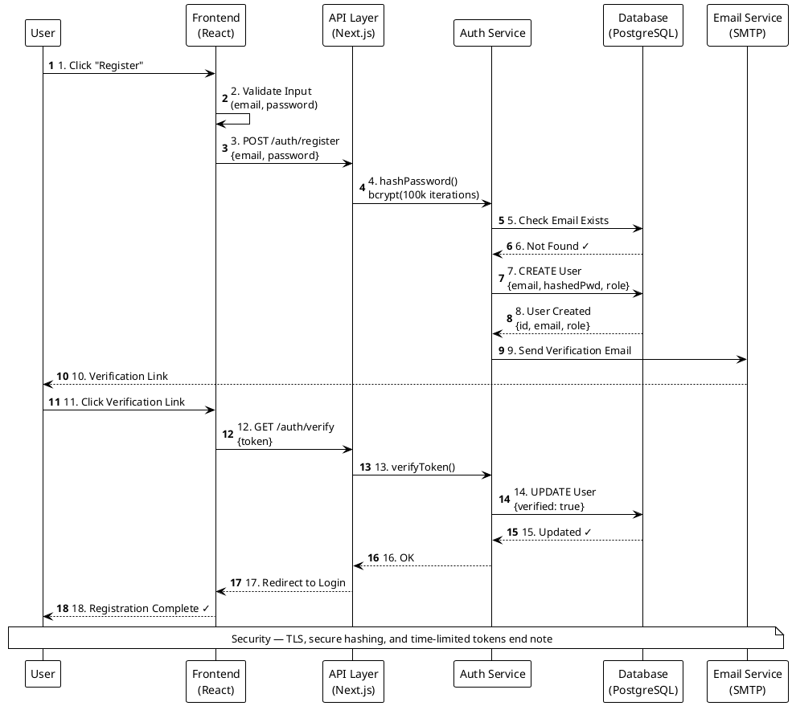
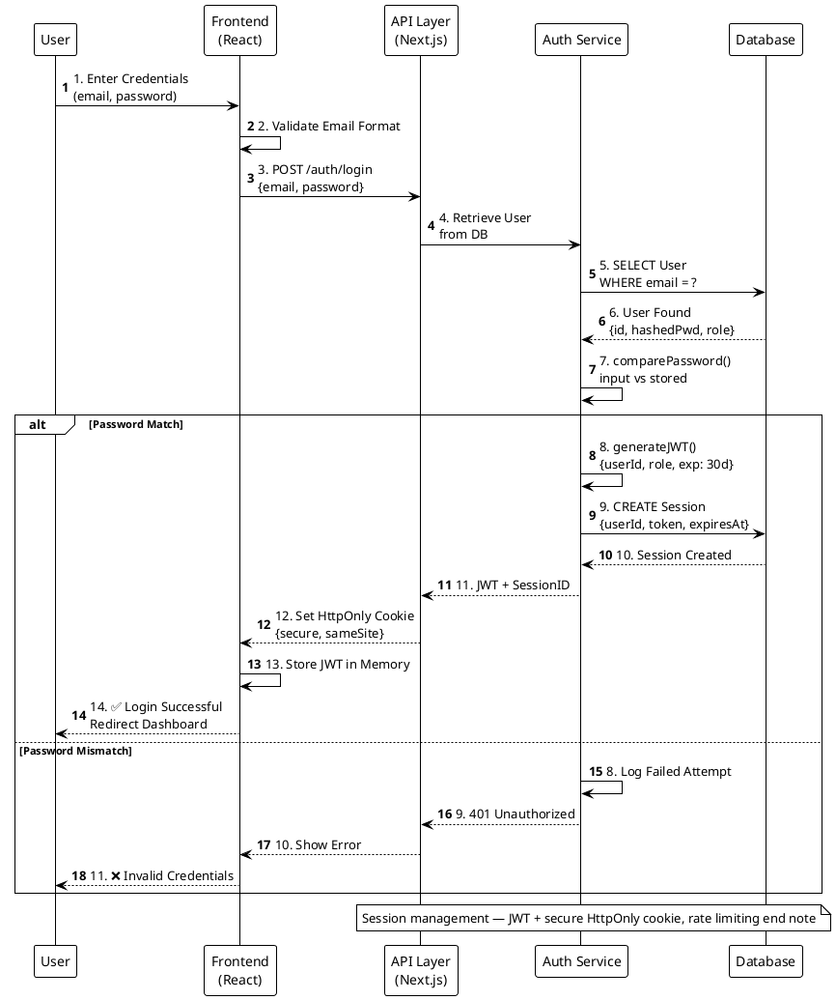
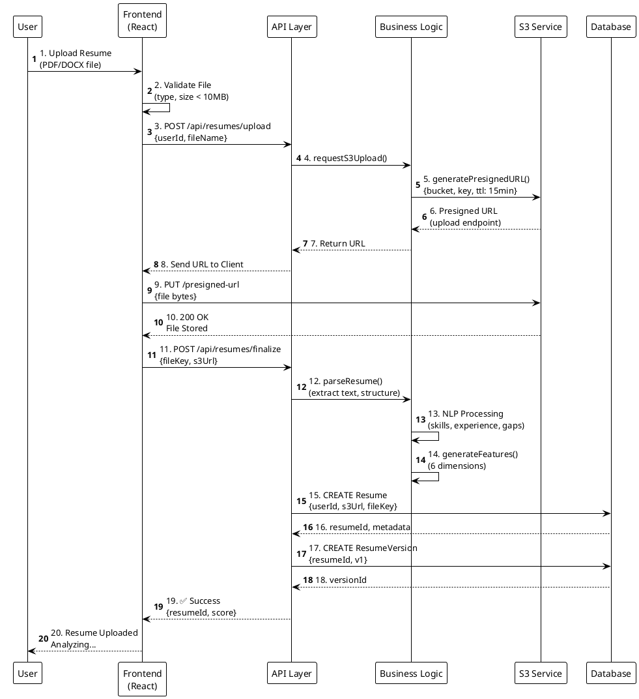
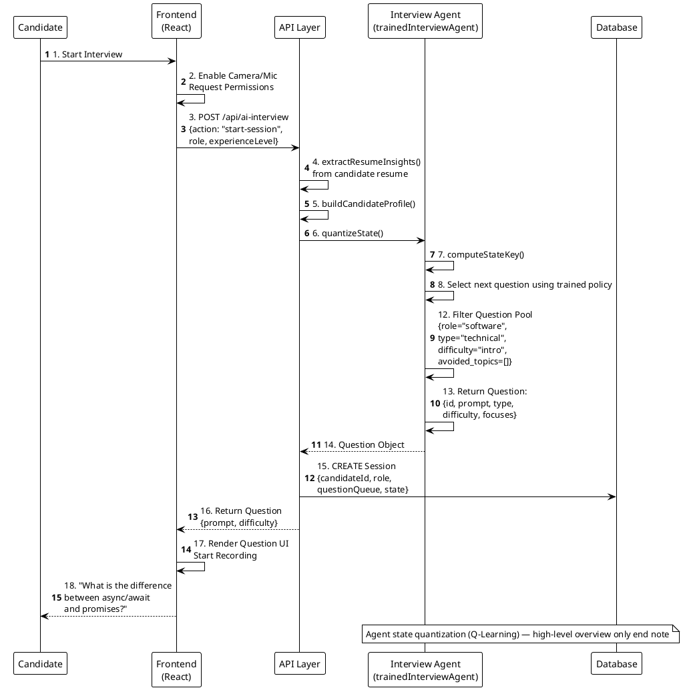
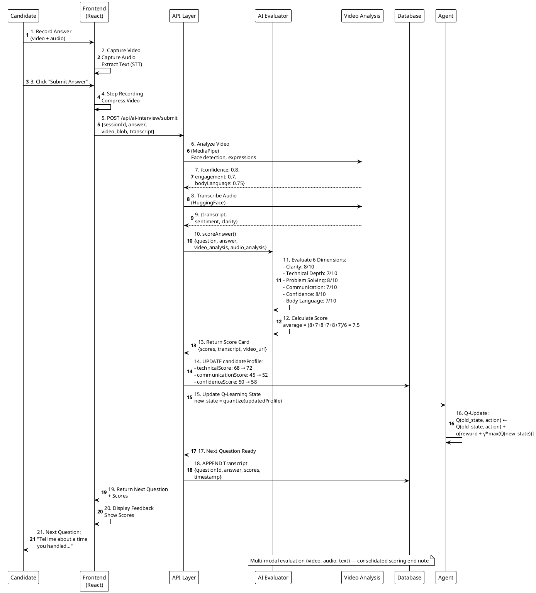
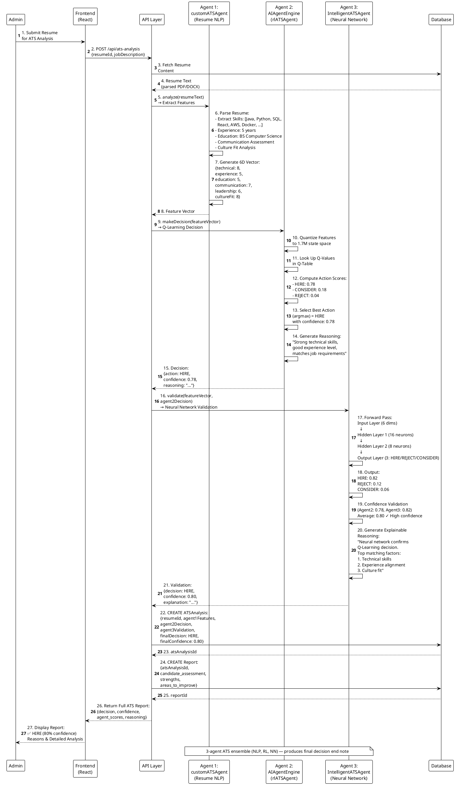
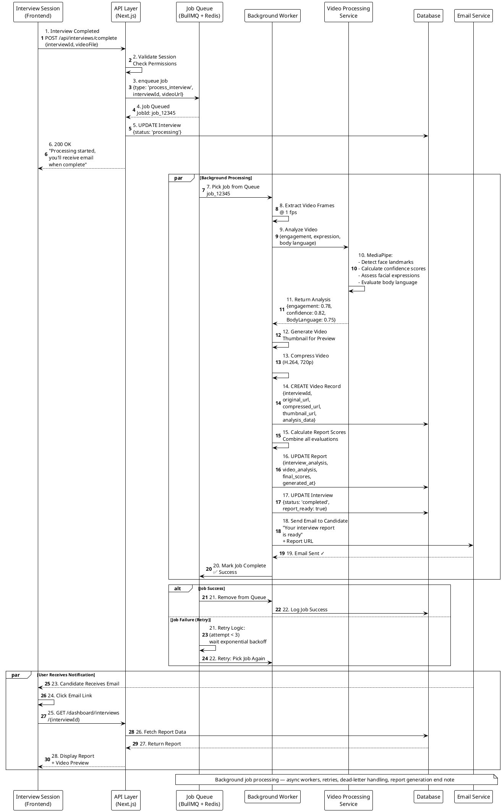
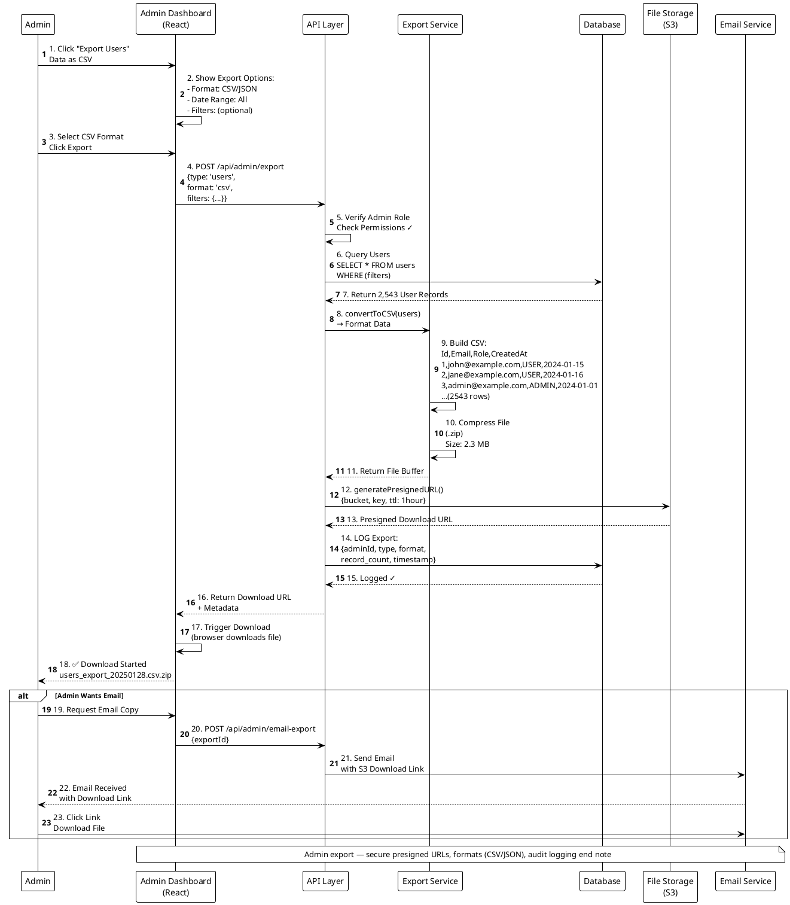
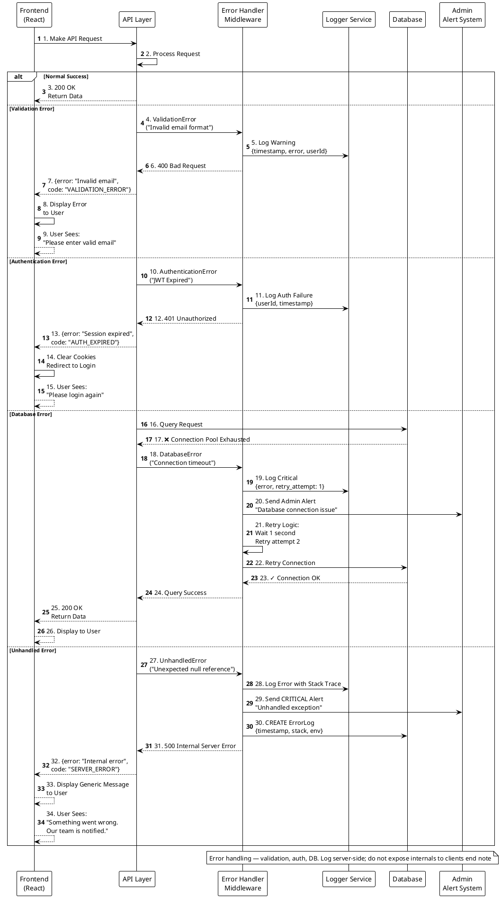
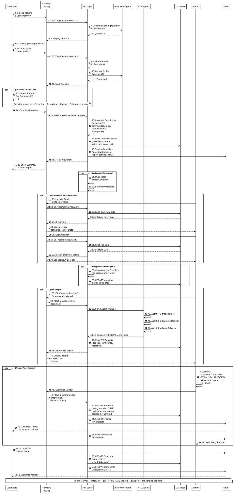

# AI²SARS — Professional PlantUML Sequence Diagrams
## University-standard, presentation-ready sequence diagrams (curated & concise)

---

## SEQUENCE DIAGRAM 1: USER AUTHENTICATION FLOW

---

## SEQUENCE DIAGRAM 2: LOGIN & SESSION CREATION

---

## SEQUENCE DIAGRAM 3: RESUME UPLOAD & S3 STORAGE

---

## SEQUENCE DIAGRAM 4: INTERVIEW SESSION - QUESTION GENERATION

---

## SEQUENCE DIAGRAM 5: INTERVIEW SESSION - ANSWER EVALUATION

---

## SEQUENCE DIAGRAM 6: ATS ANALYSIS - 3 AGENTS COLLABORATION

---

## SEQUENCE DIAGRAM 7: BACKGROUND JOB - VIDEO PROCESSING

---

## SEQUENCE DIAGRAM 8: ADMIN OPERATIONS - DATA EXPORT

---

## SEQUENCE DIAGRAM 9: ERROR HANDLING & RECOVERY

---

## SEQUENCE DIAGRAM 10: COMPLETE INTERVIEW TO HIRING DECISION

---

## HOW TO USE THESE SEQUENCE DIAGRAMS

1. **Copy any PlantUML code above**
2. **Go to**: https://www.plantuml.com/plantuml/uml/
3. **Paste the code** in the editor
4. **Click Generate** to see the diagram
5. **Export as PNG/SVG** for presentation

### Recommended Presentation Order:

1. **Complete Interview to Hiring** (Diagram 10) - Overview
2. **Login & Session** (Diagram 2) - Security foundation
3. **Resume Upload** (Diagram 3) - Data management
4. **Question Generation** (Diagram 4) - Interview Agent details
5. **Answer Evaluation** (Diagram 5) - Interview evaluation
6. **ATS 3-Agents** (Diagram 6) - ATS system deep dive
7. **Background Job** (Diagram 7) - Processing architecture
8. **Error Handling** (Diagram 9) - Reliability & robustness
9. **Admin Export** (Diagram 8) - Admin operations

### Key Features Highlighted:

✅ **All 4 AI Agents** (1 Interview + 3 ATS agents)
✅ **Complete workflows** (end-to-end processes)
✅ **Security measures** (JWT, HTTPS, rate limiting)
✅ **Multi-modal evaluation** (video + audio + text)
✅ **3-Agent collaboration** (ATS system)
✅ **Background processing** (async jobs)
✅ **Error handling** (retry logic, monitoring)
✅ **Database interactions** (all operations)
✅ **User notifications** (email, dashboard)
✅ **Admin operations** (monitoring, export)

