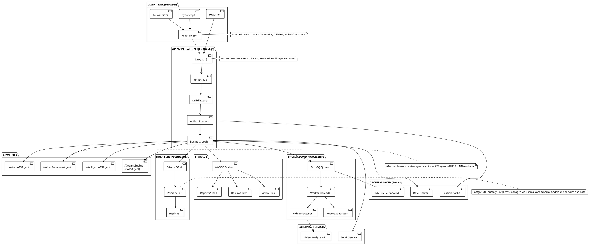
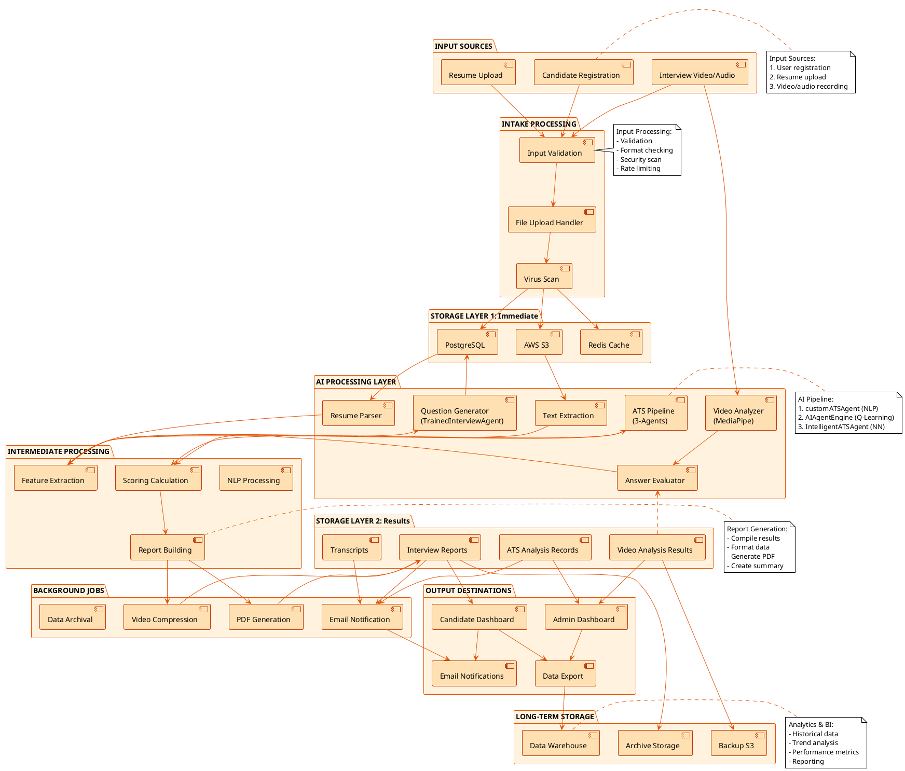
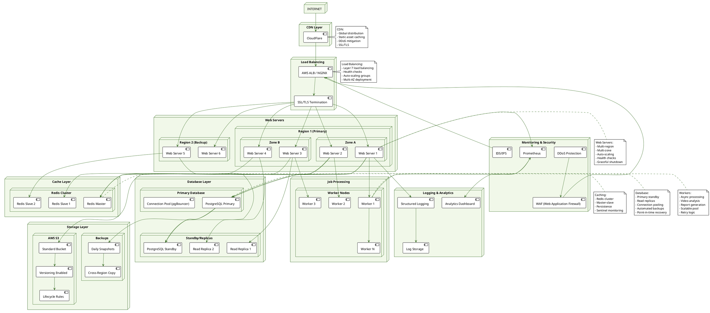
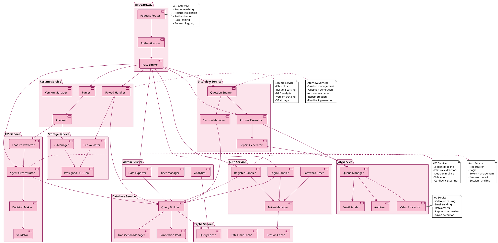
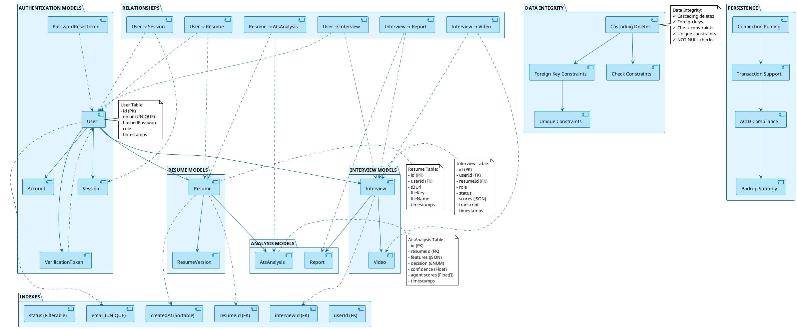

# AI²SARS — Professional PlantUML System Architecture Diagrams
## University-standard, presentation-ready architecture diagrams (curated & concise)

---

## SYSTEM ARCHITECTURE DIAGRAM 1: HIGH-LEVEL 3-TIER ARCHITECTURE

---

## SYSTEM ARCHITECTURE DIAGRAM 2: DETAILED COMPONENT ARCHITECTURE

```plantuml
@startuml Detailed_Component_Architecture
!theme plain
skinparam packageBackgroundColor #F3E5F5
skinparam packageBorderColor #512DA8
skinparam componentBackgroundColor #E1BEE7
skinparam componentBorderColor #4A148C
skinparam arrowColor #512DA8

package "PRESENTATION LAYER" {
    package "Pages" {
        component [auth/page] as AuthPage
        component [dashboard/page] as DashPage
        component [ai-interview/page] as InterviewPage
        component [ats/page] as ATSPage
        component [admin/page] as AdminPage
    }
    
    package "Components" {
        component [AIInterviewer] as AIIntComp
        component [ResumeBuilder] as ResBuilder
        component [ATSAnalyzer] as ATSAnalyzer
        component [AdminDashboard] as AdminDash
        component [Header/Footer] as NavComp
    }
    
    package "UI Library" {
        component [shadcn/ui] as ShadCN
        component [Custom Styles] as CustomStyle
    }
}

package "API LAYER" {
    package "Auth Routes" {
        component [/api/auth/register] as Register
        component [/api/auth/login] as Login
        component [/api/auth/logout] as Logout
    }
    
    package "Resume Routes" {
        component [/api/resume/upload] as Upload
        component [/api/resume/list] as ResumeList
        component [/api/resume/analyze] as ResumeAnalyze
    }
    
    package "Interview Routes" {
        component [/api/ai-interview/start] as IntStart
        component [/api/ai-interview/question] as GetQuestion
        component [/api/ai-interview/answer] as SubmitAnswer
    }
    
    package "ATS Routes" {
        component [/api/intelligent-agent] as ATSDecide
        component [/api/ats/analysis] as ATSAnalysis
    }
    
    package "Admin Routes" {
        component [/api/admin/users] as AdminUsers
        component [/api/admin/export] as AdminExport
    }
}

package "BUSINESS LOGIC LAYER" {
    package "Services" {
        component [AuthService] as AuthSvc
        component [ResumeService] as ResumeSvc
        component [InterviewService] as InterviewSvc
        component [ATSService] as ATSSvc
        component [S3Service] as S3Svc
        component [EmailService] as EmailSvc
    }
    
    package "AI Agents" {
        component [TrainedInterviewAgent] as TIA
        component [CustomATSAgent] as CAA
        component [AIAgentEngine] as AAE
        component [IntelligentATSAgent] as IAA
    }
    
    package "Utilities" {
        component [InputValidator] as Validator
        component [Encryptor] as Encrypt
        component [RateLimiter] as RateLimit
        component [AuditLogger] as AuditLog
    }
}

package "DATA ACCESS LAYER" {
    package "Repositories" {
        component [UserRepository] as UserRepo
        component [ResumeRepository] as ResumeRepo
        component [InterviewRepository] as IntRepo
        component [AtsAnalysisRepository] as ATSRepo
    }
    
    package "ORM" {
        component [Prisma Client] as PrismaClient
    }
}

package "DATABASE LAYER" {
    package "PostgreSQL" {
        component [User Model] as UserModel
        component [Resume Model] as ResumeModel
        component [Interview Model] as IntModel
        component [AtsAnalysis Model] as ATSModel
    }
}

AuthPage --> AuthSvc
DashPage --> InterviewSvc
InterviewPage --> AIIntComp
ATSPage --> ATSAnalyzer

AIIntComp --> GetQuestion
AIIntComp --> SubmitAnswer
ResBuilder --> Upload
ATSAnalyzer --> ATSAnalyze
AdminDash --> AdminExport

Register --> AuthSvc
Login --> AuthSvc
Upload --> ResumeSvc
ResumeAnalyze --> ATSSvc
IntStart --> InterviewSvc
GetQuestion --> TIA
SubmitAnswer --> InterviewSvc
ATSDecide --> ATSSvc

AuthSvc --> Validator
AuthSvc --> Encrypt
AuthSvc --> UserRepo
ResumeSvc --> S3Svc
ResumeSvc --> CAA
ResumeSvc --> ResumeRepo
InterviewSvc --> TIA
InterviewSvc --> IntRepo
ATSSvc --> CAA
ATSSvc --> AAE
ATSSvc --> IAA
ATSSvc --> ATSRepo

UserRepo --> PrismaClient
ResumeRepo --> PrismaClient
IntRepo --> PrismaClient
ATSRepo --> PrismaClient

PrismaClient --> UserModel
PrismaClient --> ResumeModel
PrismaClient --> IntModel
PrismaClient --> ATSModel

note right of AuthPage
Presentation Layer:
- React pages
- Components
- UI library
- State management
end note

note right of Register
API Layer:
- 20+ endpoints
- Request validation
- Response formatting
- Error handling
end note

note right of AuthSvc
Business Logic:
- Services
- AI agents
- Utilities
- Algorithms
end note

note right of UserRepo
Data Access:
- Repositories
- Prisma ORM
- Query building
- Transactions
end note

@enduml
```

---

## SYSTEM ARCHITECTURE DIAGRAM 3: DEPLOYMENT ARCHITECTURE

```plantuml
@startuml Deployment_Architecture
!theme plain
skinparam nodeBackgroundColor #E8F5E9
skinparam nodeBorderColor #1B5E20
skinparam arrowColor #1B5E20

node "Development Environment" {
    node "Developer Machine" {
        component [Local Next.js Dev Server] as LocalNextDev
        component [Local React Dev] as LocalReactDev
        component [Local PostgreSQL] as LocalPG
        component [Local Redis] as LocalRedis
    }
}

node "Staging Environment" {
    node "Staging Server (Linux)" {
        component [Staging Next.js] as StagingNext
        component [Staging API] as StagingAPI
        component [Node.js Runtime] as StagingNode
    }
    
    node "Staging Database" {
        component [PostgreSQL Staging] as StagingDB
        component [Backups] as StagingBackup
    }
    
    node "Staging Cache" {
        component [Redis Staging] as StagingCache
    }
}

node "Production Environment" {
    node "Load Balancer" {
        component [HTTPS/TLS 1.2+] as LoadBalancer
        component [SSL Certificates] as SSL
    }
    
    node "Application Servers (Multi-instance)" {
        component [API Server 1] as AppServer1
        component [API Server 2] as AppServer2
        component [API Server 3] as AppServer3
        component [... n instances] as AppServerN
    }
    
    node "Worker Pool" {
        component [Video Processing Worker 1] as Worker1
        component [Video Processing Worker 2] as Worker2
        component [Report Generator Worker] as ReportWorker
        component [... n workers] as WorkerN
    }
    
    node "Database Cluster" {
        node "Primary DB" {
            component [PostgreSQL Primary] as ProdDBPrimary
            component [Connection Pool] as ConnPool
        }
        
        node "Replica Servers" {
            component [Read Replica 1] as Replica1
            component [Read Replica 2] as Replica2
        }
    }
    
    node "Cache Cluster (Redis)" {
        component [Master Node] as RedisMaster
        component [Slave Node 1] as RedisSlave1
        component [Slave Node 2] as RedisSlave2
    }
}

node "Storage Layer" {
    node "AWS S3 Bucket" {
        component [Production Bucket] as S3Prod
        component [Resumes] as S3Resumes
        component [Videos] as S3Videos
        component [Reports] as S3Reports
        component [Backups (Daily)] as S3Backups
    }
}

node "Monitoring & Logging" {
    node "Monitoring Stack" {
        component [Prometheus] as Prometheus
        component [Grafana Dashboards] as Grafana
        component [AlertManager] as AlertMgr
    }
    
    node "Logging Stack" {
        component [Structured Logging] as Logger
        component [Log Aggregation] as LogAgg
        component [ELK Stack] as ELK
    }
}

node "CDN & Distribution" {
    component [CloudFlare] as CDN
    component [Static Assets] as StaticAssets
}

LocalNextDev --> StagingNext
LocalReactDev --> StagingAPI
LocalPG --> StagingDB
LocalRedis --> StagingCache

StagingNext --> LoadBalancer
StagingAPI --> LoadBalancer

LoadBalancer --> AppServer1
LoadBalancer --> AppServer2
LoadBalancer --> AppServer3
LoadBalancer --> AppServerN

AppServer1 --> ProdDBPrimary
AppServer2 --> ProdDBPrimary
AppServer3 --> Replica1
AppServerN --> Replica2

AppServer1 --> RedisMaster
AppServer2 --> RedisMaster
Worker1 --> RedisSlave1
Worker2 --> RedisSlave2

Worker1 --> S3Prod
Worker2 --> S3Prod
ReportWorker --> S3Prod

AppServer1 --> Logger
Worker1 --> Logger
Logger --> LogAgg
LogAgg --> ELK

AppServer1 --> Prometheus
Worker1 --> Prometheus
Prometheus --> Grafana
AlertMgr --> Grafana

CDN --> StaticAssets

note right of LocalNextDev
Development:
- Local dev servers
- Hot reload enabled
- Mock databases
- Debug mode
end note

note right of StagingNext
Staging:
- Pre-production setup
- Real databases (non-prod)
- Full feature testing
- Performance testing
end note

note right of LoadBalancer
Production:
- Multi-instance deployment
- Load balancing
- Auto-scaling
- SSL/TLS encryption
end note

note right of ProdDBPrimary
Database:
- Primary with replicas
- Read/write separation
- Connection pooling
- Automated backups
end note

note right of RedisMaster
Caching:
- Distributed cache
- Master-slave setup
- Session storage
- Rate limit tracking
end note

@enduml
```

---

## SYSTEM ARCHITECTURE DIAGRAM 4: DATA FLOW ARCHITECTURE

---

## SYSTEM ARCHITECTURE DIAGRAM 5: TECHNOLOGY STACK

```plantuml
@startuml Technology_Stack
!theme plain
skinparam packageBackgroundColor #E0F2F1
skinparam packageBorderColor #00695C
skinparam componentBackgroundColor #B2DFDB
skinparam componentBorderColor #004D40
skinparam arrowColor #00695C

package "FRONTEND TECHNOLOGIES" {
    component [React 19] as React19
    component [TypeScript 5.3] as TS
    component [TailwindCSS 3.4] as Tailwind
    component [Next.js Pages] as NextPages
    component [React Context API] as ContextAPI
    component [WebRTC API] as WebRTC
    component [MediaRecorder API] as MediaRec
}

package "BACKEND TECHNOLOGIES" {
    component [Node.js 18+] as NodeJS
    component [Next.js 16 (API Routes)] as NextAPI
    component [Express.js (Optional)] as Express
    component [TypeScript 5.3] as BackendTS
}

package "DATABASE TECHNOLOGIES" {
    component [PostgreSQL 15] as PG
    component [Prisma ORM 5.12.0] as Prisma
    component [SQL] as SQL
}

package "CACHING & QUEUE" {
    component [Redis 7.0] as Redis
    component [BullMQ] as BullMQ
}

package "AI/ML TECHNOLOGIES" {
    component [Q-Learning Algorithm] as QLearning
    component [Neural Networks (Custom)] as NN
    component [NLP (HuggingFace)] as HF
    component [MediaPipe] as MediaPipe
}

package "STORAGE TECHNOLOGIES" {
    component [AWS S3] as S3
    component [Presigned URLs] as PresignedURL
}

package "SECURITY TECHNOLOGIES" {
    component [TLS 1.2+] as TLS
    component [PBKDF2] as PBKDF2
    component [JWT (HS256)] as JWT
    component [OWASP Security] as OWASP
    component [bcrypt] as Bcrypt
    component [Zod Validation] as Zod
}

package "EMAIL TECHNOLOGIES" {
    component [SMTP Server] as SMTP
    component [Email Templates] as EmailTemplate
}

package "TESTING TECHNOLOGIES" {
    component [Jest] as Jest
    component [React Testing Library] as RTL
    component [Cypress (E2E)] as Cypress
    component [Vitest] as Vitest
}

package "DEPLOYMENT & DEVOPS" {
    component [Docker] as Docker
    component [Docker Compose] as DockerCompose
    component [GitHub Actions] as GHActions
    component [Linux (Ubuntu)] as Linux
    component [SSL Certificates] as SslCert
}

package "MONITORING & LOGGING" {
    component [Prometheus] as Prom
    component [Grafana] as Grafan
    component [ELK Stack] as ELK
    component [Structured Logging] as StructLog
}

package "VERSION CONTROL" {
    component [Git] as Git
    component [GitHub] as GitHub
}

React19 --> NextPages
TS --> React19
Tailwind --> React19
WebRTC --> MediaRec

NodeJS --> NextAPI
BackendTS --> NextAPI
NextAPI --> Express

NextAPI --> Prisma
PG --> Prisma

Redis --> BullMQ
NextAPI --> Redis

NextAPI --> QLearning
NextAPI --> NN
NextAPI --> HF
NextAPI --> MediaPipe

NextAPI --> S3
S3 --> PresignedURL

NextAPI --> TLS
NextAPI --> Bcrypt
NextAPI --> JWT
NextAPI --> Zod
NextAPI --> PBKDF2

NextAPI --> SMTP
SMTP --> EmailTemplate

NextAPI --> Prom
Prom --> Grafan
NextAPI --> ELK
ELK --> StructLog

Git --> GitHub
GHActions --> Docker
Docker --> DockerCompose
Linux --> DockerCompose

note right of React19
Frontend Stack:
- React 19 latest
- TypeScript for type safety
- TailwindCSS for styling
- WebRTC for video/audio
- Context API for state
end note

note right of NodeJS
Backend Stack:
- Node.js 18+
- Next.js 16
- TypeScript
- REST APIs
- Server-side rendering
end note

note right of PG
Data Stack:
- PostgreSQL 15
- Prisma ORM
- 11 models
- Transactions
- Replication
end note

note right of QLearning
AI Stack:
- Q-Learning (87K & 1.7M states)
- Neural Networks (custom)
- HuggingFace models
- MediaPipe for video
end note

note right of TLS
Security Stack:
- TLS/HTTPS
- PBKDF2 hashing (100K)
- JWT tokens
- bcrypt for passwords
- Zod for validation
- OWASP compliance
end note

@enduml
```

---

## SYSTEM ARCHITECTURE DIAGRAM 6: INFRASTRUCTURE TOPOLOGY

---

## SYSTEM ARCHITECTURE DIAGRAM 7: SERVICE INTERACTIONS & API GATEWAY

---

## SYSTEM ARCHITECTURE DIAGRAM 8: DATABASE SCHEMA ARCHITECTURE

---

## HOW TO USE THESE SYSTEM ARCHITECTURE DIAGRAMS

1. **Copy any PlantUML code above**
2. **Go to**: https://www.plantuml.com/plantuml/uml/
3. **Paste the code** in the editor
4. **Click Generate** to see the diagram
5. **Export as PNG/SVG** for presentation

### Recommended Presentation Order:

1. **High-Level 3-Tier Architecture** (Diagram 1) - Overall system structure
2. **Technology Stack** (Diagram 5) - All technologies used
3. **Detailed Component Architecture** (Diagram 2) - Layered components
4. **Service Interactions** (Diagram 7) - Service communication
5. **Data Flow Architecture** (Diagram 4) - Data processing pipeline
6. **Database Schema Architecture** (Diagram 8) - Data models & relationships
7. **Deployment Architecture** (Diagram 3) - Dev/Staging/Production
8. **Infrastructure Topology** (Diagram 6) - Physical deployment

### Key Coverage:

✅ **3-Tier Architecture** (Presentation, API, AI/Data)
✅ **Complete Component Layer** (Pages, Components, Services, Repositories)
✅ **All 4 AI Agents** (trainedInterviewAgent, customATSAgent, AIAgentEngine, IntelligentATSAgent)
✅ **Deployment Environments** (Development, Staging, Production)
✅ **Data Flow** (Input → Processing → Storage → Output)
✅ **Technology Stack** (React, TypeScript, Next.js, Node.js, PostgreSQL, Redis, S3)
✅ **Infrastructure** (Load balancing, caching, database replication, workers)
✅ **Service Interactions** (API Gateway, Auth, Resume, Interview, ATS, Job, Admin)
✅ **Database Schema** (11 models, relationships, indexes, integrity)
✅ **Security Features** (TLS, JWT, Rate Limiting, Input Validation)

**Architecture Principles Applied:**
- Separation of concerns (3-tier)
- Scalability (load balancing, caching, workers)
- Reliability (replication, backups, failover)
- Security (encryption, validation, rate limiting)
- Performance (caching, async processing, indexing)
- Maintainability (microservice patterns, clear interfaces)

