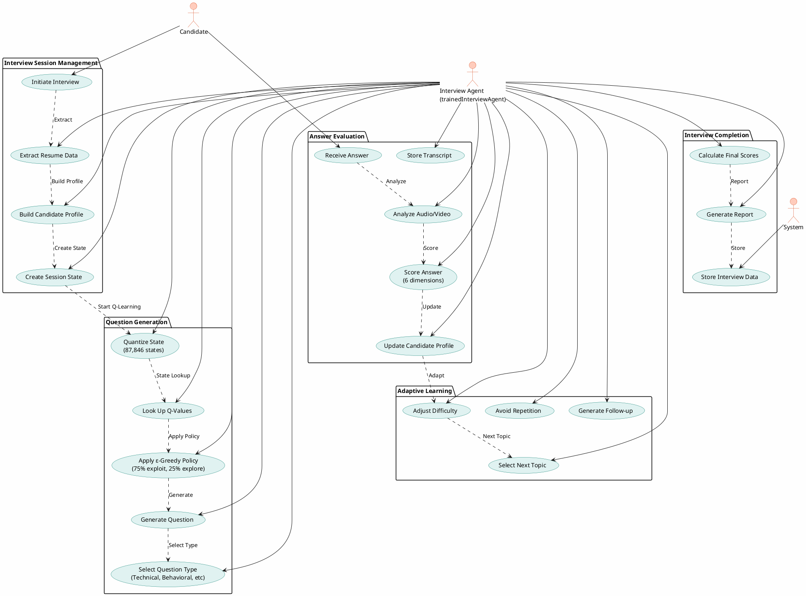
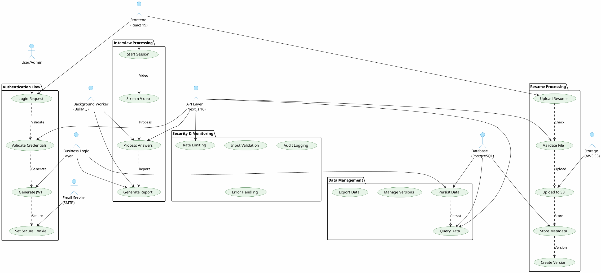
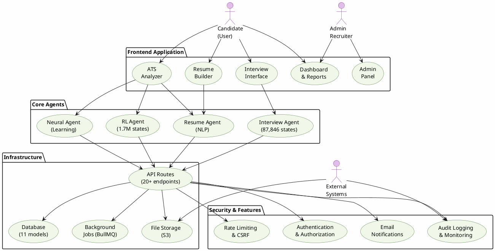

# AI²SARS — Professional PlantUML Use Case Diagrams
## University-standard, presentation-ready use case diagrams (curated & concise)

---

## DIAGRAM 1: CANDIDATE/USER USE CASES

```plantuml
@startuml Candidate_Use_Cases
!define AWSPUML https://raw.githubusercontent.com/awslabs/aws-icons-for-plantuml/v14.0/dist

actor "Candidate/User" as User
actor "System" as Sys

package "User Management" {
    usecase "Register Account" as UC1
    usecase "Login" as UC2
    usecase "Logout" as UC3
    usecase "Reset Password" as UC4
    usecase "Update Profile" as UC5
}

package "Resume Management" {
    usecase "Upload Resume" as UC6
    usecase "Create Resume" as UC7
    usecase "View Resume History" as UC8
    usecase "Download Resume" as UC9
    usecase "Delete Resume" as UC10
}

package "Interview Simulation" {
    usecase "Start Interview" as UC11
    usecase "Answer Questions" as UC12
    usecase "Enable Camera/Mic" as UC13
    usecase "Submit Interview" as UC14
    usecase "View Interview Report" as UC15
    usecase "Download Report (PDF)" as UC16
}

package "ATS Analysis" {
    usecase "Analyze Resume (ATS)" as UC17
    usecase "View ATS Score" as UC18
    usecase "Get Optimization Tips" as UC19
}

package "Dashboard" {
    usecase "View Interviews" as UC20
    usecase "View Reports" as UC21
    usecase "Access Analytics" as UC22
}

User --> UC1
User --> UC2
User --> UC3
User --> UC4
User --> UC5
User --> UC6
User --> UC7
User --> UC8
User --> UC9
User --> UC10
User --> UC11
User --> UC12
User --> UC13
User --> UC14
User --> UC15
User --> UC16
User --> UC17
User --> UC18
User --> UC19
User --> UC20
User --> UC21
User --> UC22

UC1 ..> Sys: Email Verification
UC4 ..> Sys: Send Reset Link
UC6 ..> Sys: Upload to S3
UC7 ..> Sys: Generate Template
UC11 ..> Sys: Create Session
UC12 ..> Sys: Evaluate Answer
UC14 ..> Sys: Generate Report
UC17 ..> Sys: ATS Scoring

@enduml
```



---

## DIAGRAM 2: ADMIN USE CASES

```plantuml
@startuml Admin_Use_Cases

actor "Admin" as Admin
actor "System" as AdminSys

package "User Management" {
    usecase "View All Users" as AC1
    usecase "View User Details" as AC2
    usecase "Delete User Account" as AC3
    usecase "Reset User Password" as AC4
    usecase "Assign Roles" as AC5
}

package "Content Management" {
    usecase "View All Resumes" as AC6
    usecase "View All Interviews" as AC7
    usecase "View All Reports" as AC8
    usecase "View All Videos" as AC9
    usecase "Delete Content" as AC10
}

package "Data Export" {
    usecase "Export Users (JSON)" as AC11
    usecase "Export Users (CSV)" as AC12
    usecase "Export Interviews Data" as AC13
    usecase "Export Reports Data" as AC14
}

package "System Monitoring" {
    usecase "View System Logs" as AC15
    usecase "Monitor Performance" as AC16
    usecase "View Error Logs" as AC17
    usecase "Access Audit Trail" as AC18
}

package "Configuration" {
    usecase "Update System Settings" as AC19
    usecase "Manage AI Agent Config" as AC20
    usecase "Set Rate Limits" as AC21
}

Admin --> AC1
Admin --> AC2
Admin --> AC3
Admin --> AC4
Admin --> AC5
Admin --> AC6
Admin --> AC7
Admin --> AC8
Admin --> AC9
Admin --> AC10
Admin --> AC11
Admin --> AC12
Admin --> AC13
Admin --> AC14
Admin --> AC15
Admin --> AC16
Admin --> AC17
Admin --> AC18
Admin --> AC19
Admin --> AC20
Admin --> AC21

AC1 ..> AdminSys: Query Database
AC2 ..> AdminSys: Fetch Details
AC3 ..> AdminSys: Delete Records
AC6 ..> AdminSys: Retrieve Resumes
AC11 ..> AdminSys: Export JSON
AC12 ..> AdminSys: Export CSV
AC15 ..> AdminSys: Query Logs

@enduml
```



---

## DIAGRAM 3: AI AGENT - INTERVIEW SYSTEM USE CASES



---

## DIAGRAM 4: AI AGENTS - ATS SYSTEM USE CASES (3 AGENTS)

```plantuml
@startuml ATS_Agents_Use_Cases
skinparam backgroundColor #FEFEFE
skinparam actor {
    BackgroundColor #F8BBD0
    BorderColor #C2185B
}
skinparam usecase {
    BackgroundColor #FCE4EC
    BorderColor #880E4F
}

actor "Resume" as Resume
actor "Agent 1: customATSAgent\n(NLP Analyzer)" as AtsAgent1
actor "Agent 2: AIAgentEngine\n(rlATSAgent - Q-Learning)" as AtsAgent2
actor "Agent 3: IntelligentATSAgent\n(Neural Network)" as AtsAgent3
actor "System" as AtsSys

package "Agent 1: Resume Analysis" {
    usecase "Extract Text" as AA1
    usecase "Parse Sections" as AA2
    usecase "Extract Skills\n(1000+ terms)" as AA3
    usecase "Calculate Experience" as AA4
    usecase "Assess Education" as AA5
    usecase "Evaluate Communication" as AA6
    usecase "Build 6D Feature Vector" as AA7
}

package "Agent 2: Q-Learning Decision" {
    usecase "Quantize Features\n(1.7M states)" as AA8
    usecase "Look Up Q-Table" as AA9
    usecase "Compute Action Scores" as AA10
    usecase "Select Decision\n(HIRE/REJECT/CONSIDER)" as AA11
    usecase "Calculate Confidence" as AA12
}

package "Agent 3: Neural Network Validation" {
    usecase "Forward Pass" as AA13
    usecase "Validate Decision" as AA14
    usecase "Generate Reasoning" as AA15
    usecase "Store Learning" as AA16
}

package "ATS Output" {
    usecase "Create ATS Report" as AA17
    usecase "Generate Score" as AA18
    usecase "Provide Feedback" as AA19
}

Resume --> AA1
AtsAgent1 --> AA1
AtsAgent1 --> AA2
AtsAgent1 --> AA3
AtsAgent1 --> AA4
AtsAgent1 --> AA5
AtsAgent1 --> AA6
AtsAgent1 --> AA7
AtsAgent2 --> AA8
AtsAgent2 --> AA9
AtsAgent2 --> AA10
AtsAgent2 --> AA11
AtsAgent2 --> AA12
AtsAgent3 --> AA13
AtsAgent3 --> AA14
AtsAgent3 --> AA15
AtsAgent3 --> AA16
AtsSys --> AA17
AtsSys --> AA18
AtsSys --> AA19

AA1 ..> AA2: Parse
AA2 ..> AA3: Extract Skills
AA3 ..> AA4: Quantify
AA4 ..> AA5: Evaluate
AA5 ..> AA6: Assess
AA6 ..> AA7: Feature Vector
AA7 ..> AA8: To Agent 2
AA8 ..> AA9: Q-Lookup
AA9 ..> AA10: Score Actions
AA10 ..> AA11: Decide
AA11 ..> AA12: Confidence
AA12 ..> AA13: To Agent 3
AA13 ..> AA14: Validate
AA14 ..> AA15: Reasoning
AA15 ..> AA16: Learn
AA16 ..> AA17: Report
AA17 ..> AA18: Score
AA18 ..> AA19: Feedback

@enduml
```



---

## DIAGRAM 5: SYSTEM INTEGRATION USE CASES



---

## DIAGRAM 6: COMPLETE SYSTEM ECOSYSTEM



---

## DIAGRAM 7: DATA FLOW - COMPLETE JOURNEY

```plantuml
@startuml Data_Flow_Journey
skinparam backgroundColor #FEFEFE
skinparam actor {
    BackgroundColor #FFE0B2
    BorderColor #E65100
}
skinparam usecase {
    BackgroundColor #FCCDD7
    BorderColor #880E4F
}

actor "Candidate Starts" as Start

package "Resume Upload Phase" {
    usecase "1. Upload Resume\n(PDF/DOCX)" as DF1
    usecase "2. Parse & Extract\n(NLP Processing)" as DF2
    usecase "3. Generate Features\n(6 Dimensions)" as DF3
    usecase "4. Calculate ATS Score\n(3 Agents)" as DF4
    usecase "5. Store in S3\n& Database" as DF5
}

package "Interview Phase" {
    usecase "6. Start Interview\nSession" as DF6
    usecase "7. Generate Questions\n(trainedInterviewAgent)" as DF7
    usecase "8. Record Answer\n(Video/Audio)" as DF8
    usecase "9. Evaluate Answer\n(Multi-modal)" as DF9
    usecase "10. Update Profile\n& Generate Next Q" as DF10
}

package "Reporting Phase" {
    usecase "11. Complete Interview\nSession" as DF11
    usecase "12. Calculate Scores\n(All dimensions)" as DF12
    usecase "13. Generate Report\n(PDF + JSON)" as DF13
    usecase "14. Store Results\n& Artifacts" as DF14
}

package "Follow-up Phase" {
    usecase "15. Send Notifications\n(Email)" as DF15
    usecase "16. User Reviews\nReport" as DF16
    usecase "17. Admin Reviews\nCandidate" as DF17
    usecase "18. Make Hiring\nDecision" as DF18
}

Start --> DF1
DF1 --> DF2
DF2 --> DF3
DF3 --> DF4
DF4 --> DF5
DF5 --> DF6
DF6 --> DF7
DF7 --> DF8
DF8 --> DF9
DF9 --> DF10
DF10 --> DF7: Next Question
DF10 --> DF11: Session End
DF11 --> DF12
DF12 --> DF13
DF13 --> DF14
DF14 --> DF15
DF15 --> DF16
DF16 --> DF17
DF17 --> DF18

@enduml
```



---

## HOW TO USE THESE DIAGRAMS

1. **Copy any PlantUML code above**
2. **Go to**: https://www.plantuml.com/plantuml/uml/
3. **Paste the code** in the editor
4. **Click Generate** to see the diagram
5. **Export as PNG/SVG** for presentation

### For Best Results:

**In PowerPoint:**
- Diagram 1, 2, 6, 7 → Full slides (high detail)
- Diagram 3, 4, 5 → Can be split into 2 slides each if needed

**Recommended Slide Order:**
1. System Ecosystem (Diagram 6) - Overview
2. Data Flow Journey (Diagram 7) - Complete flow
3. Candidate Use Cases (Diagram 1) - User perspective
4. Admin Use Cases (Diagram 2) - Admin perspective
5. Interview Agent (Diagram 3) - AI deep dive
6. ATS Agents (Diagram 4) - AI deep dive
7. System Integration (Diagram 5) - Technical architecture

---

## PowerPoint export tips

- Quick PlantUML snippet to make diagrams slide-friendly (add immediately after `@startuml`):

```text
scale 0.8
skinparam wrapWidth 60
skinparam dpi 150
skinparam defaultFontSize 12
```

- Recommended workflow:
    1. Copy a single diagram block into the PlantUML web editor or into a `.puml` file.
    2. Insert the four lines above right after `@startuml`.
    3. Export as **SVG** (preferred) or **PNG**; SVG scales crisply in PowerPoint.

- Local CLI export example (requires plantuml.jar):

```bash
java -jar plantuml.jar -tsvg diagram.puml
```

- If a diagram is still too dense for one slide, I can split it into 2–3 focused diagrams optimized for slides.


**All diagrams include:**
✅ Complete system coverage
✅ All 4 AI agents
✅ All data flows
✅ All user journeys
✅ Security & infrastructure
✅ Database & storage interactions
✅ Background processing
✅ Admin operations

